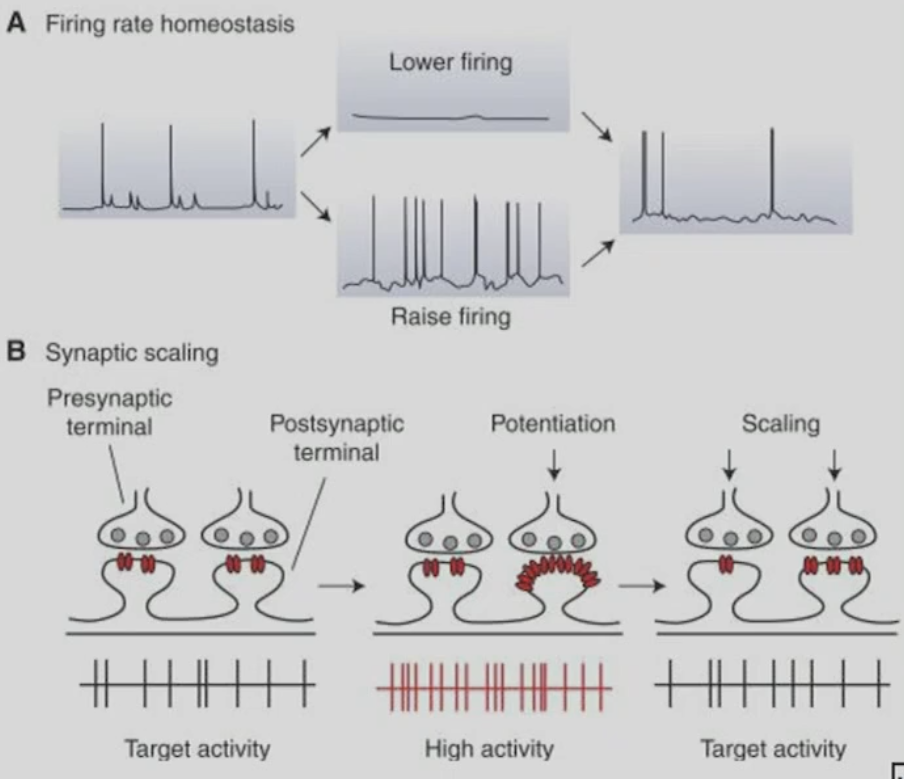
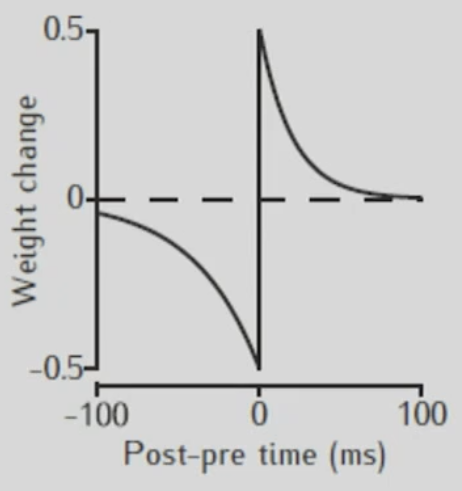
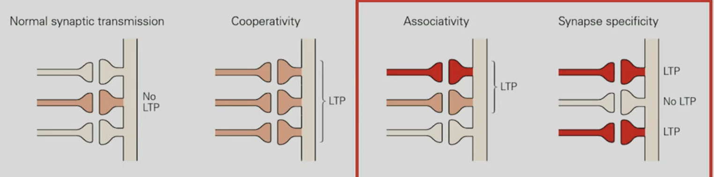
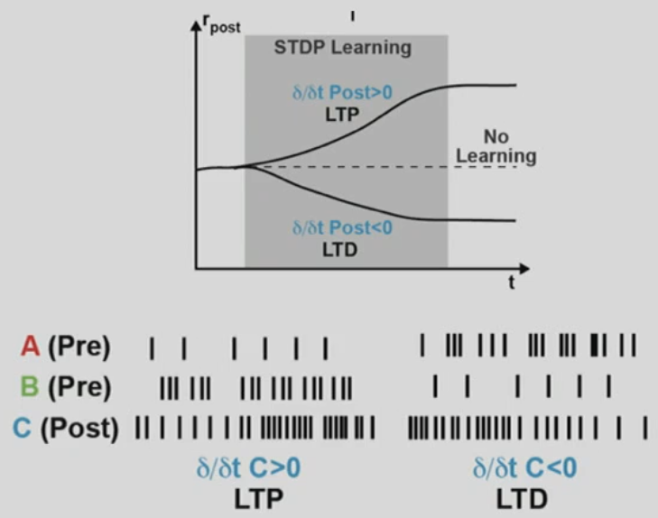
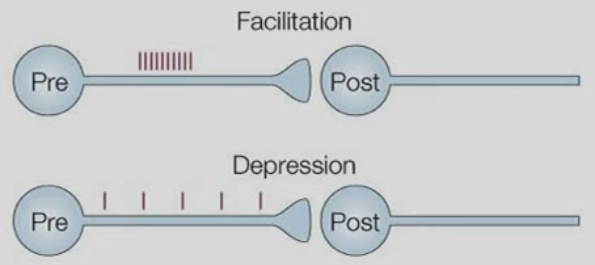
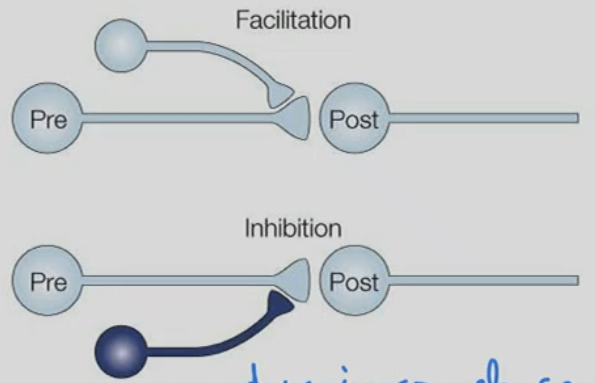
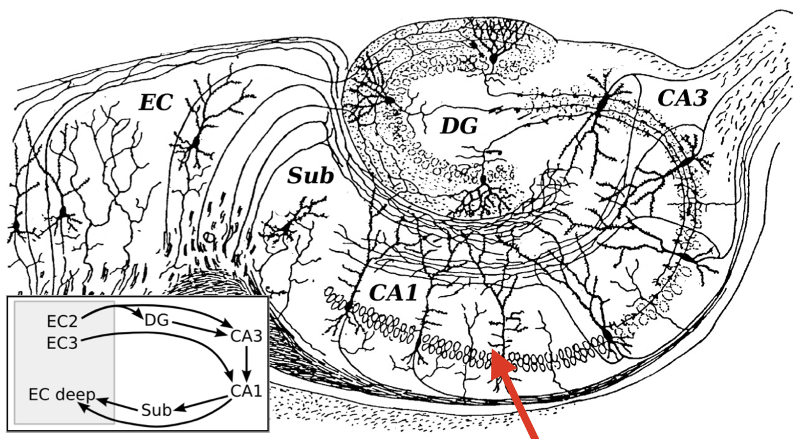

# 02 Plasticity in the Brain

## Motivation
- biological plasticity might provide a different angle to understand the training procedures in DNNs
- Given the effectiveness of human brain learning, bio-plasticity might provide inspiration / new ideas for improved DNN training algorithms
- understanding biological plasticity might help to better understand how (hierarchical) learnign is organized in the brain (learnign & memory)
- Many neural disorders such as dementia (痴呆) relate to disturbance in neuronal plasticity that cause neuronal networks to become dysfunctional

- definition:
    - *Plasticity*: Plasticity allows the acquisition of knowledge/information and the formation of a memory through experience.
    - *Memory*: Storage of information that can be recalled at a later stage in time.
    - Note: Learning results in memory - which has a further outcome - it can change future behavior.

## Synaptic Plasticity
- EPSP first decrease then increase, when it reaches threshold, it starts to fire.
- Ca2+ influx in pre-synaps --> vesicles release, fuse to membrane --> binds to AMPA recepter of post-synap --> Na+ influx --> EPSP
- neurotransmitters:
    - amino acids: glutamate, GABA
    - biogneic Amines: Dopamine, Histamine
    - Neuropeptides: LHRH Proctolin
- I remember that Ca2+ is used in both pre and post. 
    - pre use voltage gated channels to control vesicles release
    - post use NMDA to control long term potentiation
- LTP
    - more vesicles on pre side
    - more AMPA on post side
    - synapses grow in size
- cells are usually not connected only in one single synapse,
    - EPSP is strongly correlated to the size,
    - cross section of synapses linearly correlated to number of AMPA channels
- 1. Synaptic density size changes (short term).
- 2. AMPA/NMDA ratio changes (short term).
    - NMDA stays constant
- 3. Number of spines changes (long term).

### Time scales of synaptic plasticity 
- Time scale
    - short-term: seconds to minutes
    - long term: 10min - 60min
    - long-lasting: 60 min + , structural changes

### Homeostatic (稳态) Plasticity
- to ensure the activity of each layer is constant
    - sort of like a normalizaiton in biology
- keep the average firing rate

## Hebbian Plasticity
- Donald Hebb 1949: *“When an axon of cell A is near enough to excite cell B and repeatedly or persistently takes part in firing it, some growth process or metabolic change takes place in one or both cells such that A's efficiency, as one of the cells firing B, is increased.”*
- A Hebbian synapse is a “coincidence detector”

- example of Hebbian Learning: Spike-Time Dependent Plasticity (STDP)
    - 
### Hebb's Idea on how neurons can learn association
- specificity:
    - pre neuron A active while B not, only A get strenthened
- Associativity
    - pre neuron A have strong stimulation, then both A B strengthened.
- Cooperativity: one single neuron is not enough to drive plasticity
    - 
- to learn association
    - example: when you see and tast coffee, you establish this plasticity, then when you see the coffee, you can imagine the smell.
    - weight update ``\dot{w}=H(\text { pre, post })``
- Problems of Hebbian Learning, by Hinton *Ups and Downs of Hebb Synapses*
    - Hebbian rule: ``\mathrm{pre}\times\mathrm{post}``
    - error driven: ``\partial \mathrm{pre}\times \partial \mathrm{post}``, the latter one have better performance
- One solution: Trhee factor Hebbian Learning rule: ``\dot{w}=F(M, \text { pre, post })``, by EPFL's group
- Second solution (teacher's)
    - If the firing rate goes up, more likely that there is more positive post-pre time, so LTP,
        - and if the post neuron's firing rate goes down ``\delta/\delta t < 0``, then we get LTD.
    - error is encoded in the change of post firing rate, so ``\dot{w}=F(\text { pre}, \dot{\mathrm{post}})`` *differential hebbian update*
    - 

## Non-Hebbian Plasticity - *Heterosynaptic* Plasticity
- *Homosynaptic (activity-dependent) plastic change*
    - 
- *Heterosynaptic* (modulatory input-dependent) plastic change
    - 
    - e.g. dopamine co-release
- teacher does not talk about this

## Hippocampus as a model system to study neural plasticity
- hippocampus have a circular structure
    - 
- block of NMDA in HC leads to incapability of mice navigation
    - blocking other part cannot lead to dysfunction
- place cell

- most studied on CA3 -> CA1 cells
    - first short term facilitation,
    - then depression, due to exhaustion of vesicles
- paired pulse facilitation
    - two short input, the second pulse have larger amplitude
    - caused by residual Ca2+ in the synapse
- PTP (tetanuous stimulus) leads to LTP
    - 50-200 Hz
    - lower frequency (5Hz) leads to LTD
    - the level and timing of Ca2+ rise in spine determines LTD and LTP
- Ca2+ level may also explain STDP

## Intracellular Plasticity Signaling Pathways
- voltage gated Ca2+ channel (VGCC)
    - increase Ca2+, gated by V
- Clutmate binds to AMPA, and release Na+
    - Leads to depolar of V
- NMDR (influx of Na+ and Ca2+)
    - leads to depolar of V and Ca2+ influx
- mAh (C2+ Channel)
    - Ca2+ Influx
- D2 receptor (dopamin receptor)
    - goes to ER (receptor), internal Ca2+ store --> release of Ca2+
- mGluR, another recepter to ER to release Ca2+
- CaKIII: Ca2+ concentration detector
    - only binds Ca2+ at specific intermediate level
    - this molecue leads to the CREB pathway --> leads to AMPA going down
- CaKIV and CaKII binds at high Ca2+ concentration
    - leads to AMPA concentration going up.
- There are receptors does not involve calcium
    - D1 receptor -> A.C. -> CREB
- Why teacher shows this?
    - bio neuron is much more complex than ML neuron
    - error signal, might possibly be the Ca2+ signal, but in neuron, this is both local and global.

## Non-synaptic (intrinsic) plasticity
- Changes in Neuronal Excitability and Repetitive Firing.
- DCN cells (ceep cerebellum nucleas)
    - tetanic stimulus leads to increasing number of spikes (to a plateau), increase the excitability of synapses