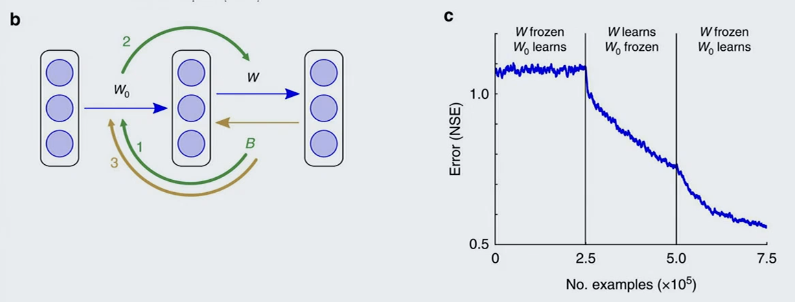
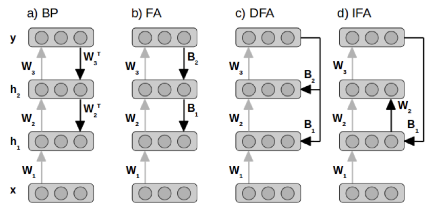
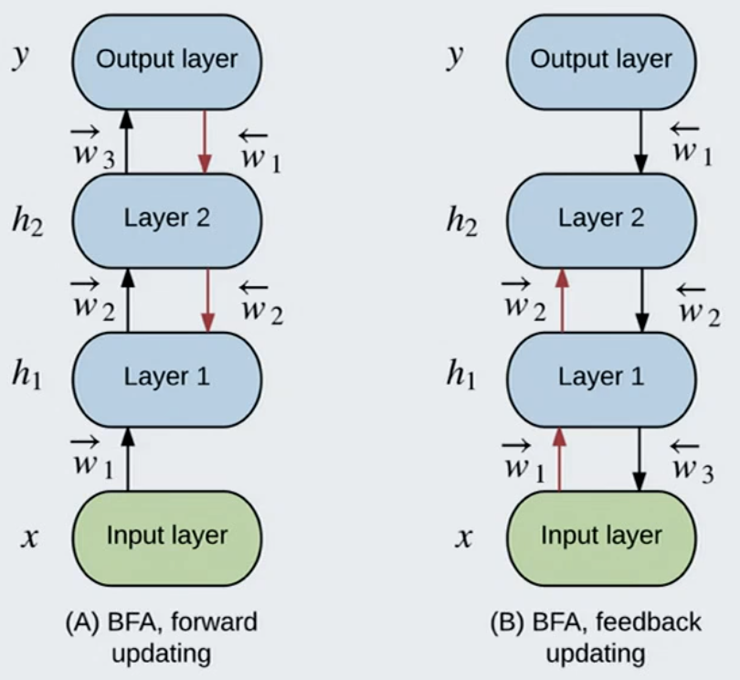

# 03 Training Methods for Deep Artificial Networks (feedback alignment)
- motivation
    - BP might not be optimal, in particular to train generative models
    - BP is not fully local and computation is not easy to parallelise
    - BP needs to store all network activations for the BP steps
    - Understanding DNN training and optimisation methods might provide a different angle to understand learning in biological networks in the Brain
    - Given that the functionality of DNNs is reflected by biological networks the different variants of DNN training even provide testable hypothesis that neuroscience research can test.

## Backprop
- cost ``C=\frac{1}{2 n} \sum_x\left\|y(x)-a^L(x)\right\|^2``
- activation ``a_j^l = \sigma\left(\sum_k w_{j k}^l a_k^{l-1}+b_j^l\right)``
- forwarding ``z_k^{l+1}=\sum_j w_{k j}^{l+1} a_j^l+b_k^{l+1}=\sum_j w_{k j}^{l+1} \sigma\left(z_j^l\right)+b_k^{l+1}``
- in BP we define the error signal as ``\delta_j^l \equiv \frac{\partial C}{\partial z_j^l}``
- the last layer ``\delta_j^L=\frac{\partial C}{\partial a_j^L} \frac{\partial a_j^L}{\partial z_j^L} =\frac{\partial C}{\partial a_j^L} \sigma^{\prime}\left(z_j^L\right)``
- error signal in hidden layer ``\delta_j^l=\frac{\partial C}{\partial z_j^l} =\sum_k \frac{\partial C}{\partial z_k^{l+1}} \frac{\partial z_k^{l+1}}{\partial z_j^l} =\sum_k \frac{\partial z_k^{l+1}}{\partial z_j^l} \delta_k^{l+1} =\sum_k w_{k j}^{l+1} \delta_k^{l+1} \sigma^{\prime}\left(z_j^l\right)`` where ``\frac{\partial z_k^{l+1}}{\partial z_j^l}=w_{k j}^{l+1} \sigma^{\prime}\left(z_j^l\right)``
- error signal for weight update ``\frac{\partial C}{\partial w_{j k}^l}=a_k^{l-1} \delta_j^l`` 
    - [activation from pre-synaptic neuron] x [ouput neuron error from post-synaptic side]
    - *not biologically plausible* because ``\delta^l`` needs informaiton from following layer ``w^{l+1}`` and ``\delta^{l+1}``, but there is no biological mechanism to achieve this.
    - another set of weights to go backwards, no single neuron loop
    - no error signal

## Feedback Alignment
- bio motivation: there is also backward connection
- in BP: ``\Delta w_k^l=h_k^{l-1} \delta_{B P j}^l=h_k^{l-1} \sum \delta_{B P_j^{l+1}}^l w_{j k}^{l+1} \sigma^{\prime}\left(z_j^l\right)``
- FA: ``\Delta w_k^l=h_k^{l-1} \delta_{F A_j^l}=h_k^{l-1} \sum \delta_{F A_j^{l+1}}^{l+} \beta_{j k}^{l+1}  \sigma^{\prime}\left(z_j^l\right)``
    - ``\beta`` is a random but fixed matrix
- achieve competitive performance w.r.t BP for one-layer NN
    - even better performance (not overfitting) on MNIST
- but does not scale to deep network, maybe
- why FA work?
    - in the original paper, they did a training step by step
        - learning can be though of as steply transfer 1. first post to preside, 2. then pre-synaptic informaiton to postside, and then 3. .... 
            - the random B only affects W in second stage.
        - so that these neurons can coorperate (which is not so convincing to me...)
    - they also show that, the angle of weight by BP and FA is always ``\leq 90^\circ``, so the direction of descent is roughly correct.

### Variants of Feedback Alignment
- consider a three layer network ``a_1=W_1 x+b_1, h_1=f\left(a_1\right)``, ``a_2=W_2 h_1+b_2, h_2=f\left(a_2\right)``, ``a_y=W_3 h_2+b_3, \hat{y}=f_y\left(a_y\right)``, ``J=-\frac{1}{N} \sum_{m, n} y_{m n} \log \hat{y}_{m n}+\left(1-y_{m n}\right) \log \left(1-\hat{y}_{m n}\right)``, 
- error defined as ``e=\delta a_y=\frac{\partial J}{\partial a_y}=\hat{y}-y``
- All weight update can be summarized as ``\delta W_1=-\delta a_1 x^T, \delta W_2=-\delta a_2 h_1^T, \delta W_3=-e h_2^T``, and the difference is:
    - in **BP** the update goes ``\delta a_2=\frac{\partial J}{\partial a_2}=\left(W_3^T e\right) \odot f^{\prime}\left(a_2\right), \delta a_1=\frac{\partial J}{\partial a_1}=\left(W_2^T \delta a_2\right) \odot f^{\prime}\left(a_1\right)``
    - in **FA**: ``\delta a_2=\left(B_2 e\right) \odot f^{\prime}\left(a_2\right), \delta a_1=\left(B_1 \delta a_2\right) \odot f^{\prime}\left(a_1\right)``
    - in **Direct FA (DFA)**: ``\delta a_2=\left(B_2 e\right) \odot f^{\prime}\left(a_2\right), \delta a_1=\left(B_1 e\right) \odot f^{\prime}\left(a_1\right)``
    - in **Indirect FA (IFA)**: ``\delta a_2=\left(W_2 \delta a_1\right) \odot f^{\prime}\left(a_2\right), \delta a_1=\left(B_1 e\right) \odot f^{\prime}\left(a_1\right)``
    - 

    
    
#### Bi-directional Feedback alignment (BDFA)
- not random feedback weight, learned weight
- use feedforward weight to update feedback weight

#### Deep Learnign without Weight Transport
- idea: since it is all about feedback and feedforward weight aligning, why we don't just set such kind of learning rule for the feedback weights, so that it will align to the feedforward weight.
- FA backward: ``\boldsymbol{\delta}_l=\phi^{\prime}\left(\boldsymbol{y}_l\right) \mathbf{B}_{l+1} \boldsymbol{\delta}_{l+1}``
- forward weight update ``\Delta \mathbf{W}_{l+1}=-\eta_W \boldsymbol{\delta}_{l+1} \mathbf{y}_l^T``
- (new part) feedback weight update ``\Delta \mathbf{B}_{l+1}=\eta_B \boldsymbol{\delta}_l \boldsymbol{\delta}_{l+1}^T``

## (Difference) Target Propagation (as BP alternative)
- by Bengio
- idea: not send back error, but send back targets
- assign activation to a nearby value ``\hat{\mathbf{h}}_i``, which we might have lower global loss, in other words we want ``L\left(\mathbf{h}_M\left(\hat{\mathbf{h}}_i ; \theta_W^{i, M}\right), \mathbf{y}\right)<L\left(\mathbf{h}_M\left(\mathbf{h}_i\left(\mathbf{x} ; \theta_W^{0, i}\right) ; \theta_W^{i, M}\right), \mathbf{y}\right)``
    - such a  ``\hat{\mathbf{h}}_i`` is called target of ``i``-layer

    - then weight can be updated localy within this layer by SGD ``W_i^{(t+1)}=W_i^{(t)}-\eta_{f_i} \frac{\partial L_i\left(\hat{\mathbf{h}}_i, \mathbf{h}_i\right)}{\partial W_i}=W_i^{(t)}-\eta_{f_i} \frac{\partial L_i\left(\hat{\mathbf{h}}_i, \mathbf{h}_i\right)}{\partial \mathbf{h}_i} \frac{\partial \mathbf{h}_i\left(\mathbf{x} ; \theta_W^{0, i}\right)}{\partial W_i}``
    - we add additional ``L_i\left(\hat{\mathbf{h}}_i, \mathbf{h}_i\right)=\left\|\hat{\mathbf{h}}_i-\mathbf{h}_i\left(\mathbf{x} ; \theta_W^{0, i}\right)\right\|_2^2``
- how to assign proper target: 
- on top layer ``\hat{\mathbf{h}}_M=\mathbf{h}_M-\hat{\eta} \frac{\partial L\left(\mathbf{h}_M, \mathbf{y}\right)}{\partial \mathbf{h}_M}``
- on the rest
    - Forward pass: ``h_i = f_i(h_{i-1})``
    - Backward pass: ``\hat{h}_i = g_i(\hat{h}_{i+1})``
- we want ``f_i\left(g_i\left(\mathbf{h}_i\right)\right) \approx \mathbf{h}_i`` and ``g_i\left(f_i\left(\mathbf{h}_{i-1}\right)\right) \approx \mathbf{h}_{i-1}``
    
    - we need an inverse loss ``L_i^{i n v}=\left\|g_i\left(f_i\left(\mathbf{h}_{i-1}\right)\right)-\mathbf{h}_{i-1}\right\|_2^2``, we want some generalizaiton so add some noise ``L_i^{i n v}=\left\|g_i\left(f_i\left(\mathbf{h}_{i-1}+\epsilon\right)\right)-\left(\mathbf{h}_{i-1}+\epsilon\right)\right\|_2^2, \quad \epsilon \sim N(0, \sigma)``
- problem: 
    - most of the time, inverse loss takes dominant, this is most of the part of training
    - whenever you change feedforward weight, you have to train again the feedback weight
- Difference Target Propagation solves this by learning only the difference: ``\hat{\boldsymbol{h}}_i=\boldsymbol{h}_i+g_i\left(\hat{\boldsymbol{h}}_{i+1}\right)-g_i\left(\boldsymbol{h}_{i+1}\right)=\boldsymbol{h}_i+s_i\left(Q_i \hat{\boldsymbol{h}}_{i+1}\right)-s_i\left(Q_i \boldsymbol{h}_{i+1}\right)``
    - work nicer, but this is close to BP, not biologically plausible

## Bio-Plausible Deep Learning Through Control
- teacher's own work https://arxiv.org/abs/2106.07887
- dynamic version of target propagation
    - a controller at the top, do comparison, from MSE error ``u`` to a feadback signal ``Q``
- activity of each neuron becomes ``v_i = \sigma(w_i v_{i-1} + u Q_i)``
    - this is a recurrent loop to minimize the error, through controler
    - controller is a integration control
    - feels like hidden layer receives both previous layer and top layer (but in a delayed way)
- weight update: ``\Delta W_{i, \mathrm{ss}}=\eta\left(\mathbf{v}_{i, \mathrm{ss}}-\mathbf{v}_{i, \mathrm{ss}}^{\mathrm{ff}}\right) \mathbf{r}_{i-1, \mathrm{ss}}^T``
- no gradient, only feedback signal, gradient is implicit