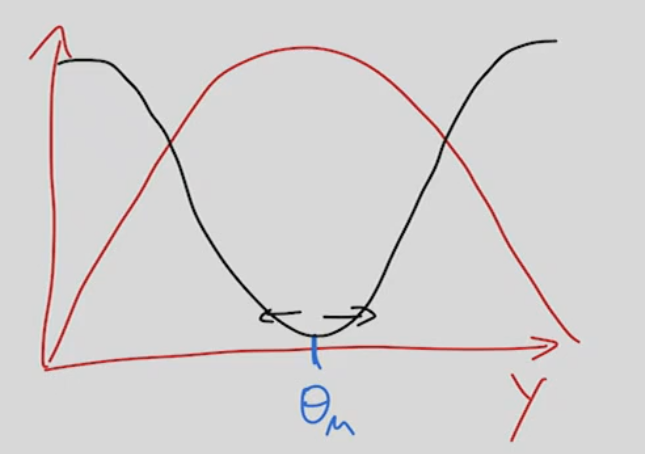
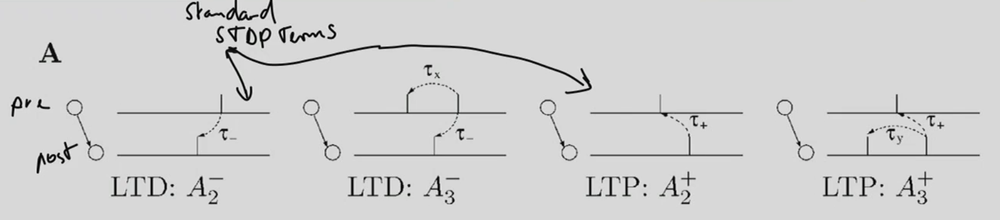

# 04 Learning Rule
- motivation: what type of architecture connect neurons' feedback update and dynamics?
    - tbh, this is a very non-understandable motivation...very non-specific

## Why (local) neuronal learning rules are important

- teacher list it in the outline, but didnot give a single slide about it.

## Perceptron learning rule
- McCulloch and Pitts
- ``\mathrm{y}(\vec{x} ; \vec{w})=\left\{\begin{array}{lc}
1 & \text { if } \sum_{i=0}^n w_i x_i>0 \\
0 & \text { otherwise }
\end{array}\right.``
- Rosenblatt's Perceptron learning rule
    - If ``x\in P`` ``w = w+x`` else ``w = w-x``
    - equivalently ``\Delta w = \alpha (t - y) x``, t is target, y is prediction 
        - (this is summarize by teacher, seems incorrect)
- Problem:
    - only linear separable data

## ADALINE and Delta rule
- ADAptive LInear NEuron
    - bypass non-linearity
- sum over the input and a linear activation function -->  a nonlinear thresholded output,
    - error is calculated before nonlinearity, then feedback for training
    - 
- Similarity with Perceptron
    - They are both classifiers for binary classifi
    - Both have a linear decision boundary.
    - Both can learn iteratively, sample by sample (the Perceptron naturally, and Adaline via stochastic gradient descent).
    - Both use a threshold function.
- difference: error signal before / after nonlinearity (threshold)
    - ??? this also cannot solve non-linearity
- Delta rule:
    - consider activation, and ues MSE loss ``E=\sum_i \frac{1}{2}\left(t_i-y_i\right)^2``
    - gives update rule of ``\Delta w_{i} = \alpha (t_i - y_i) g'(h_i) x_i``, ``y=g(h)``
    - the whole notation of ``ij`` is nonsense in teacher's slide
- difference w.r.t Perceptron
    - non-linearity derivative
    - if ReLU either 0 or constant

## Recap of Hebbian learning
- STDP: biologically verified version of hebbian learnign
- mathmetical form: ``\Delta w_{ij} = x_i \cdot y_j``, pre-synap times post synaptic
- in vector notation ``\Delta w = \alpha y x^{\top} = \alpha (w^{\top}x) x^{\top}``
    - teacher's notation is totally misleading
    - y will be maximum if ``w`` and ``x`` align.
- Problem I: If initially ``w`` points away from the cloud, the dot-product will be negative and both vectors will at the end poitns towards the opposite direction.
    - solution: do normalization on data, do zero mean
- Problem II: By some non-rigorous derivation, teacher derive it as ``w = \alpha (x x^{\top}) w^{\top}``, which does not follow matrix multiplication rule.
    - ``\Delta w = \alpha \mathbb{E}[xx^{\top}] w``, the expectation is always non-negative, so always a positive feedback, weight will blow-up.
    - teacher call it "correlation"
## Oja's rule
- this is the solution to blowing up weight problem
- use weight decay
    - ``\Delta w = \alpha y (x - y w)``
    - Important: The weight decay term is proportional to ``y^2``. That means w approaches unit length automatically while still pointing at the direction of maximum variance.

## Covariance Rule
- By TERRENCE J. SEJNOWSKI (one of the founders of Neurips), this is a second solution of weight blow up
- substract the mean, ``\Delta w = \alpha (y - \mathbb{E} y)(x - \mathbb{E} x) = \alpha (\mathbb{E}[yx] - \mathbb{E}[y]\mathbb{E}[x]) = \alpha (\mathbb{E}[xx^{\top}] - \mathbb{E}[x]\mathbb{E}[x^{\top}])w``
    - teacher did not prove, but claim this will not explode, but covariance matrix is again positive definite, is this correct?

## Sanger's Rule - Relation to PCA
- the hebbian learnign rule's matrix ``C=\mathbb{E}[xx^{\top}]``, which means, the weight will go exponentially fast for main component of ``x``
    - but it doens't go nicely as PCA, unless you use some way to force it.
- but we can use a PCA network, to sequencially get each principle component, and then remove it from data
    - 
- this is called sanger's rule
- but PCA might not be biologically plausible, because it is not local. ICA is more local, (informax) this is taught in unsupervised learning (lecture 06)

## Bienenstock-Cooper-Monroe (BCM) rule
- linear version
    - ``y=\sum_i w_i x_i``
    - ``\frac{d w_i}{d t}=y\left(y-\theta_M\right) x_i-\epsilon w_i``
    - ``\theta_M=E^p\left[\left(y / y_o\right)\right]`` threshold is thought to be the baseline of the neuron
    - y could be interpreted as membrane potential, or calcium signal
    - If no input, no update, 
    - if little input, LTD, depression
    - if strong input, LTP, weight grow
    - 
- non-linear BCM (I-BCM)
    - ``y=\sigma\left(\sum_i w_i x_i\right)``
    - ``\frac{d w_i}{d t}=y\left(y-\theta_M\right) x_i \sigma^{\prime}(y)``
    - ``\theta_M=E\left[y^2\right]``
    - energy function this learning rule implies: ``R=-\frac{1}{3} E\left[y^3\right]+\frac{1}{4} E^2\left[y^2\right]``
    - 
    - every y below threshould, this rule pulls it down, above threshold, push up.   
- People have observed similar rules in biology

## Triplet Rule (Pfister & Gerstner) 
- STDP for two spikes
    - sequential spikes: pre-post, post-pre, pre-post-pre, post-pre-post
    - 
    - ``A_3^{-}, A_3^+`` is the new one.
- update function 
    - ``w(t) \rightarrow w(t)-o_1(t)\left[A_2^{-}+A_3^{-} r_2(t-\epsilon)\right] \text { if } t=t^{\mathrm{pre}}``
    - ``w(t) \rightarrow w(t)+r_1(t)\left[A_2^{+}+A_3^{+} o_2(t-\epsilon)\right] \text { if } t=t^{\text {post }}``
    - weight only update at spike time,
- if there is only two spikes, then we will get a normal STDP
- but if there is a third spike, the weight's abolte increase will be depending on the timing of pre and post:
    - 
    - the mean weight update w.r.t frequency (while fixing the pre-synaptic freq) is 
        - we arrive at something like a BCM rule

## Calcium Rule
- derived from the fact of Calcium concentration in post cell can affect AMPA pathways
- Calcium rule
    - each pre-synap pules cause the release of some calcium inside post cell
    - there is two threshould ``\theta_p > \theta_d``, nothing --> depression --> potentiation 
        - (teacher deliberately low down his voice to make this unclear)
    - 
- the rule in that paper:
    - ``\tau \frac{d \rho}{d t}=-\rho(1-\rho)\left(\rho_{\star}-\rho\right)+\gamma_p(1-\rho) \Theta\left[c(t)-\theta_p\right]-\gamma_d \rho \Theta\left[c(t)-\theta_d\right]+\operatorname{Noise}(t)``
    - the first term is sort of like a baseline?
    - second and third term is the calcium dependency
    - I believe this is a master equation for mean value equation for this stochastic process.
- This is very strange, the above formulat did not say anything about post-synaptic spike, while the paper's figure shows something like this, and they also claim they achieved some BCM rule
    - 

## Extensions of hebbian learning rules
- the main problem of hebbian learnign rule, is that it is a correlation of pre and post value, no error signal 
- paper *Unsupervised learning of digit recognition using spike-timing-dependent plasticity* show that if we 
    - do first a Hebbian learning rule neurons, to learn the digit cluster
    - then use supervised learning on top of the clustering
    - thwen we can get better performance on MNIST
    - but does not scale well
- solution: three factor hebbian learning rules ``\dot{w}=F(M, \text { pre }, \text { post })`` where this ``M`` can be 
    - 
