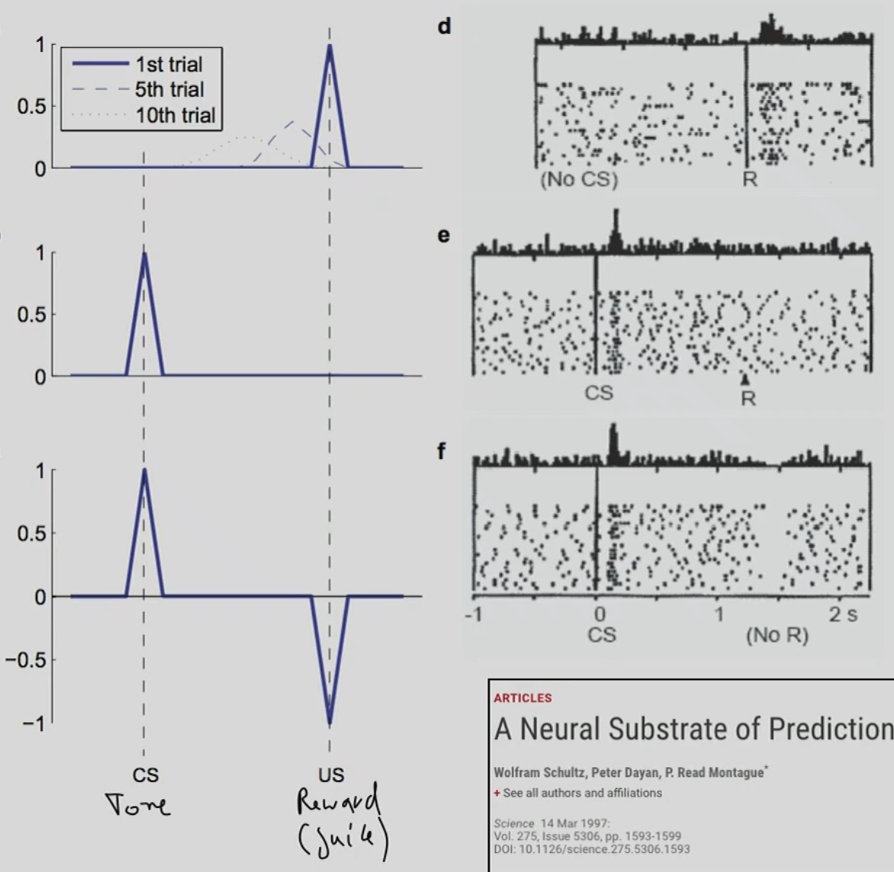
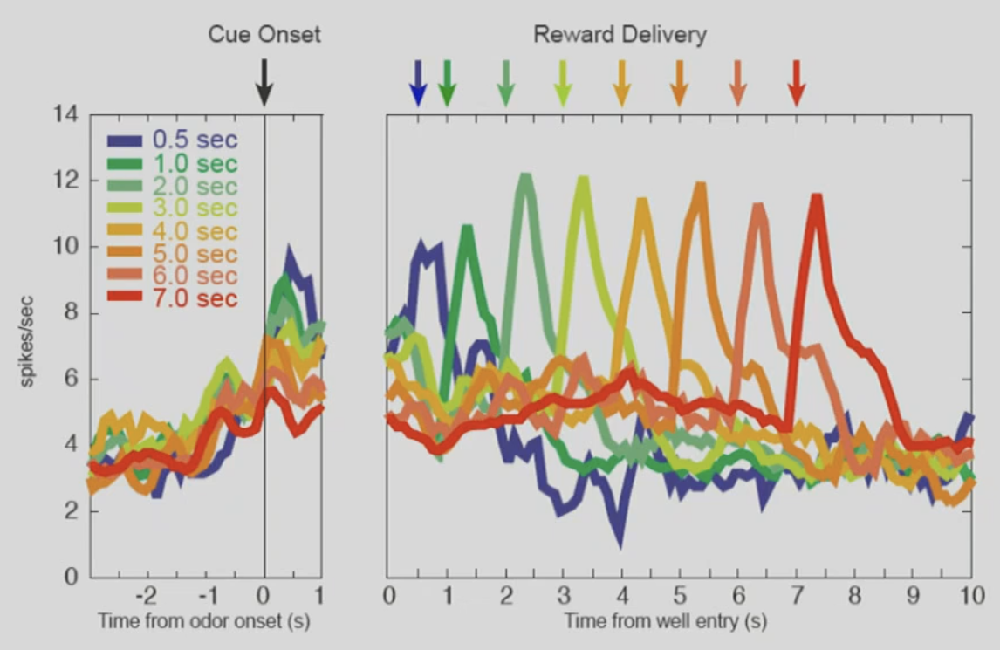

# 05 reinforement learning
- environment gives (next) state and reward to agent
    - tbh, I don't think its the environment defines reward, but the intention of agent...
- agent sends action to environment
- different from both supervised and unsupervised learning
    - there is only a reward/supervision signal after each action
    - feedback is often delayed and not instantaneous. Time needs to be taken into account
    - agnet's actions affect the subsequent data it receives

## RL and the brain
- world sends signal ==> [(part of brain) receied by sensory processing ==> cognition memory descition making ==> motor processing] ==> motor action act to world
- *Wolfram Schultz*'s famouse work "*Predictive Reward Signal of Dopamin Neurons*"
    - the idea of whole idea of dopamine acts like RL TD signal
    - dopamine neurons show 
        - 1. phasic activations after primary liquid and food rewards, (unexpected reward)
        - 2. and conditioned, reward-prediction visual and auditory stimuli (conditioned stimuli before reward)
    - they show biphasic (either excitation of inhibition), activation-depression response after stimuli, that resemble reward-predicting stimuli (or the stimuli is novel or salient)
    - thus dopamine neurons label environmental stimuli with appetitive (有食欲的) value, predict and detect rewards and signal alerting and motivating events
    - If prediction is exactly as predicted, no signal 
- Dopamine neuron in Ventral Tegment Area (VTA) project dopamine neuron to all parts of cortex
- V1 and V2 receptors binds to dopamine neurons, one inhibiting and other exciting
    - pakinsin patient lose dopamin neuron
- Another paper by Wolfram Schultz *A neural Substrate of Prediction and Reward* tells almost the same thing, a summary of this is 
- Schultz's paper *Adaptive Coding of Reward Value by Dopamine neurons* shows this signal is proportional to the (expected) amount of reward you get
    - the visual cue (stimulus)'s neuron reaction is also proportional to signal
- This signal can also encoder delay time, 
    - longer delay, the less dopamine neuron reacts to stimuli 

    
##  The Rescorla Wagner Rule (1972)
- idea error-driven learning derived from classical conditioning experiments 
- change in value ``V(s_t)`` is proportional to the difference between actual and predicted reward ``V\left(s_t\right) \leftarrow V\left(s_t\right)+\eta\left[R-\operatorname{sum}\left(V\left(S_t\right)\right)\right]``
    - ? I suspect the last term is the expectation, not sumation.
- two assumption
    - learning is driven by the error signal (formalized as notion of surprise)
        - you have to put a signal term into this rule, only study when there is a signal...
    - summation of preditors is linear
- This formulation is incorrect, please refer to the slides in course Neural System.

## Temperal Difference (TD) Rule
- idea: Update the value (V) of the current state (s) based on the immediate reward and the estimated value of the next state.
- ``V\left(s_t\right) \leftarrow V\left(s_t\right)+\eta\left[r_{t+1}+\gamma V\left(S_{t+1}\right)-V\left(S_t\right)\right]``

## Q-learning
- ``Q(S, A) \leftarrow Q(S, A)+\alpha\left(R+\gamma \max _{a^{\prime}} Q\left(S^{\prime}, a^{\prime}\right)-Q(S, A)\right)``

## Basic Components of RL
- rewards:
    - a scalar feedback of signal
    - indicates how well the agent is doing at step t
    - The agent’s job is to maximize cumulative reward. 
- Reinforcement learning is based on the reward hypothesis:
    - All goals can be described by the maximization of expected cumulative reward. 
- Actions may have long term consequences.
- rewards may be delayed. 
- It may be better to sacrifice immediate reward to gain more long-term reward.
- Agent state ``S_t^a``:
    - is the agent’s internal representation, 
    - whatever information the agent uses to pick the next action 
    - it is the information used by reinforcement learning algorithms 
    - It can be any function of the history: ``S_t^a=f\left(H_t\right)``.
- *Markov information sate* contains all useful information from the history
    - in a 1st order markov chain a state ``S_t`` is Markov iff ``P\left[S_{t+1} \mid S_t\right]=P\left[S_{t+1} \mid S_1, \ldots, S_t\right]``
    - Future is indepdendent of the past given present
    - once the state is known the history may be thrown away
    - the state is a asufficient satistic of the future
    - the environment state ``S_t^e`` is Markov
    - the history ``H_t`` is Markov.
- Policy: The agent’s behavior function. 
    - defines the agent’s behavior.
    - It is a map from state to action.
    - Deterministic policy: ``a = π(s)``
    - Stochastic policy: ``π(a|s) = P[A_t = a|S_t = s]``
- Value function: How good is each state and/or action?
    - is a prediction of future rewards.
    - It is used to evaluate the goodness/badness of states… 
    - and to select between actions.
    - ``v_\pi(s)=E_\pi\left(R_{t+1}+\gamma R_{t+2}+\gamma^2 R_{t+3}+\ldots \mid S_t=s\right)``
- Model: The agent’s representation of the environment.
    - predicts what the environment will do next. 
    - P predicts the next state.
    - R predicts the next (immediate) reward.
    - ``P_{s s^{\prime}}{ }^a=P\left[S_{t+1}=s^{\prime} \mid S_t=s, A_t=a\right]``
    - ``R_s^a=E\left[R_{t+1} \mid S_t=s, A_t=a\right]``
- subtypes of RL
    - Value Based
        - no policy, policy implicit by value function
        - value function
    - Policy Based
        - Policy
        - no value function
    - Model Free
        - learn the policy or value function
        - no model
    - Model Based
        - learn both policy/value func and model
- Diff of RL and Planning
    - RL:
        - env initially unknown
        - agent interacts with env
        - agent improves its policy or value func
    - Planning
        - model of env known
        - agent performs compuations with its model )wihtout any external interaction)
        - agent improves policy
- Exploration exploitation dilema
    - Reinforcement learning is ‘trial-and-error’ learning. The agent should discover a good policy from its experiences of the environment without losing too much reward along the way.
    - *Exploration* finds more information about the environment.
    - *Exploitation* exploits known information to maximize reward. It is usually important to explore as well as exploit.
## MDP
- Markov decision processes formally describe an environment for reinforcement learning. 
    - the environment is fully observable.
    - Almost all RL problems can be formalized as MDPs:
        - Partially observable problems can be converted into MDPs. 
        - One Armed Bandits are MDPs with one state.
- *Markov Reward Process*
    - A Markov reward process is a Markov chain with reward values. 
    - A Markov Reward Process is a tuple ``\langle S, P, R, \gamma \rangle``
    - S is a finite set of states 
    - P is a state transition probability matrix, ``P_{s s^{\prime}}=P\left[S_{t+1}=s^{\prime} \mid S_t=s\right]``
    - R is reward function ``R_s=E\left[R_{t+1} \mid S_t=s\right]``
    - ``\gamma`` is a discount factor ``\gamma \in[0,1]``
- Why discount futrue rewards?
    - Mathematically convenient to discount rewards. 
    - Avoids infinite returns in cyclic Markov processes. 
    - Uncertainty about the future may not be fully represented. 
    - If the reward is financial, immediate rewards may earn more interest than delayed rewards. 
    - Animal/human behavior shows preference for immediate rewards.
    - It is sometimes possible to use un-discounted Markov reward processes (i.e. ``γ = 1``), e.g. if all sequences terminate.
- Return definition ``G_t=R_{t+1}+\gamma R_{t+2}+\ldots=\sum_{k=0}^{\infty} \gamma^k R_{t+k+1}``
    - γ close to 0 leads to ”myopic” evaluation
    - γ close to 1 leads to ”far-sighted” evaluation
- MRP value funciton: ``v(s)=E\left[G_t \mid S_t=s\right]``, The state value function v(s) of an MRP is the expected return starting from state s.
- Bellmann Expectation Equation of MRPs
    - ``v(s) = E\left[R_{t+1}+\gamma v\left(S_{t+1}\right) \mid S_t=s\right]``
- *Markov Decision Process* (MDP): ``\langle S, A, P, R, \gamma \rangle``
    - S is a finite set of states.
    - A is a finite set of actions.
    - P is a state transition probability matrix, ``P_a=P\left[S_{t+1}=s^{\prime} \mid S_t=s, A_t=a\right]``
    - R is a reward function, ``R_s^a=E\left[R_{t+1} \mid S_t=s, A_t=a\right]``
    - ``\gamma`` is a discount factor ``γ ∈ [0, 1]``.
    - value function ``v_\pi(s)=E_\pi\left[G_t \mid S_t=s\right]``
    - action-value function ``\mathrm{q}_\pi(\mathrm{s}, \mathrm{a})=\mathrm{E}_\pi\left[\mathrm{G}_{\mathrm{t}} \mid S_t=\mathrm{s}, A_t=\mathrm{a}\right]``
- Bellman Expectation eq
    - ``v_\pi(s)=E_\pi\left[R_{t+1}+\gamma v_\pi\left(S_{t+1}\right) \mid S_t=s\right]``
    - ``q_\pi(s, a)=E_\pi\left[R_{t+1}+v q_\pi\left(S_{t+1}, A_{t+1}\right) \mid S_t=s, A_t=a\right]``
- optimal aciton-value function ``v^*(s)=\max v_\pi(s)``, ``q^*(s, a)=\max q_\pi(s, a)``
- Bellman Eq
    - ``v_*(s)=\max _a \mathcal{R}_s^a+\gamma \sum_{s^{\prime} \in \mathcal{S}} \mathcal{P}_{s s^{\prime}}^a v_*\left(s^{\prime}\right)``
    - ``q_*(s, a)=\mathcal{R}_s^a+\gamma \sum_{s^{\prime} \in \mathcal{S}} \mathcal{P}_{s s^{\prime}}^a \max _{a^{\prime}} q_*\left(s^{\prime}, a^{\prime}\right)``
    - non-linear
    - no closed form
- How to solve?
    - policy iteration
    - value iteration
    - Q-learning