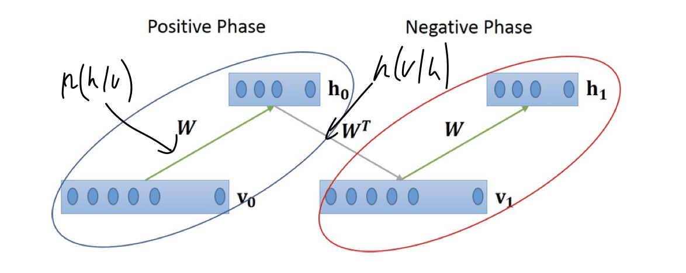

# Unsupervised and Self-supervised Learning
- motivation: (from Geoffrey Hinton) back-prop with ground truth label is not biologicaly plausible
- unsupervised learning 
    - does not need labelled data
    - is able to learn reveal the intricate structure (features) and can be used for dimensionality reduction. 
    - is able to generate new data examples that are consistent with the statistics of the training data.
    - can predict future data examples (e.g. video frame prediction).
    - can be used to detect familiar or out-of-distribution examples.
    - can facilitate future supervised learning.
    - can be used to cluster the data.
    - can be used to de-noise data.
    - can be used to encode data in a particular way (e.g. for data compression).
- definition: clustering v.s. finding a boundary (supervised)
- taxtonomy:
    - non-prob
        - sparse coding
        - autoencoder
        - KNN, K-means
    - prob
        - tractable models
            - fully observed belief nets
            - pixel rnn
        - non-tractable
            - boltzmann machine
            - VAE
            - Helmholtz machine
        - GANs, Moment-to-Moment network

## Unsupervised learning in the brain
- Kenji Doya's summary about the brain
    - unsupervised learning: only input and output
    - rl: with additional reward signal
    - supervised learning: with additional target/error signal
- basal ganglia is suspected to do reinforcement learning,
- while in cerebellium, motor learning, the neuron structure is suspected to do supervised learning
- the cortex is suspected to do unsupervised learning (Peter Dayan, and David Marr)
- Experiment on visual cortex, the orphan cat 60s (Blakemore and Cooper)
    - cats put into dark at born
    - and then put into cylender with only vertical or horizontal lines
    - what is the responses?
        - blocked eye result in less neuron connection from this eye to visual cortex, but re-revealing it will make it functional again
            - only within in a window period of 3 weeks to 3 months
        - for the cat with only horizontal line env (prevent it from seeing itself), to 3 month
            - then put back to normal visual env, it has no visual placing experience, if objects suddenly goes to it, it has no reaction of escaping away
            - not following moving object, unless there is sound
            - within hours the cat feels normal again, but with permanent damage
            - after few days of normal env, it has typical visual placing, but visual ability is not complete, it cannot react to vertical lines
        - there is no vertical responsive neurons
    - the whole process of generiting vertical/horizonal filters is totally unsupervised
- Jozsef Fiser's work:
    - setting:
        - neural activiy as coordinates,
        - no stimulus distribution as prior
        - visual stimulus distribution of activities as posterior,
        - reducing images to black --> posterior to prior
    - during early stage development, if shown natural images, prior is more and more similar to posterior, but less similar given artificial stimulus
        - artifitial stimuli does not follow natual distribution
    - for human it is about 6 days, 
- Haishan Yao and Yang Dan's work: on temporal dimension
    - add some angle of rotation (``\pm 15 ^{\circ}``) to images as initial sequence, adn then give the normal vertical lines, 
    - find the neuron's response curve also tuned by this angle
- James DiCarlo's work: similarity in correlation matrix similar btw monkey and supervised ANN
    - but the monkey's training is always unsupervised

## unsupervised learning in ML
### non-probabilistic UL
#### sparse coding (Olshausen and Field)
- idea: each image can be represented by a set of basis funcitons ``I(x,y) = \sum_i a_i \phi_i(x,y)``, ``a_i`` should be sparse
- loss ``E=`` [preserve information] + [sparseness on ``a_i``]
    - ``=\sum_{xy}[I(x,y) - \sum_i a_i \phi(x,y)]^2 + \xi\sum_i S(a_i/\sigma)``, where ``\sigma`` is scaling constant and ``S(\cdot)`` is sparsity controlling function, typically ``-e^{x^2}``, ``\log (1+x)``, ``|x|``.
- update rule of ``a_i``: ``\partial_{a_i} E = \dot{a}_i = b_i - \sum_j c_{ij} a_j - \xi/\sigma S'(a/\sigma)``. where ``b_i = \sum_{xy} \phi_i(x,y) I(x,y)`` and ``c_{i,j} = \sum_{xy} \phi_i(x,y) \phi_j(x,y)``
- update rule of ``\phi_i``: ``\Delta \phi_i(x, y) = \eta \langle a_i [I(x,y) - \hat{I}(x, y)]\rangle``, where ``\hat{I}(x, y) =  \sum_i a_i \phi(x,y)`` is the reconstructed image
- Given training set of sparse {pixels, gratings, gabors}, the basis function also gives the coresponding type of function
    - if given natual images, we get edge filters
    - edge filters are also discovered in V2 in brain
#### Ball & Sejnowski's Infomax (ICA)
- information-maximization 
- also independent components (ICA)
- compare to PCA, which gives non-sparse, global features, ICA gives edge filters, which is quite local
    - probably brain is also doing similar things
- math: we want each component to be nearly independent ``p(x_1, \ldots, x_n) = \prod_i p(x_i)`` (compared with before, we only need uncorrelatedness)
- equivalent to mimizing the mutual information of two patterns ``I(Y,X) = H(Y) - H(Y|X) = KL(P(X,Y) | P(X)\otimes P(Y))``, mutual information is symmetric.
    - also equivalent to maximizing the joint entropy ``H(X,Y)``
    - gradient ascent of this objective is called *INFORMAX*
- formulation: (equiv to reverse auto encoder), a forward nn from input to feature ``y = \sigma( W_1 x)`` and reverse ``x = \sigma(W_2 y)``
    - the loss is reconstruction loss + independency loss
- conclusion:
    - ICA is similar to PCA, except that we’re looking for a transformation subject to the stronger requirement of independence, rather than uncorrelatedness. 
    - no analytic solution, use NN and GD to optimize
    - For the ICA NN implementation, we need an architecture and an objective function to descend/climb. 
    - Results in N independent (or as independent as possible) components in an N-dimensional space; these don’t need need to be orthogonal. 

#### Auto Encoder
- encoder + decoder, with information bottle neck
    - MSE loss ``\mathcal{L} = \frac{1}{N}\sum_i [x_i - f_\theta(g_\phi(x_i))]^2``
    - bottle neck for dimension reduction
- semi-supervised autoencoder
    - some data have label
    - recosntruciton loss + supervision loss
- de-noising autoencoder
    - add nosie to original image, and try to reconstruct
    - feature robust to noise
    - similar to dropout
- contracting autoencoder
    - It adds a term in the loss function to penalize the representation being too sensitive to the input, and thus improves the robustness to small perturbations around the training data points. 
    - The sensitivity is measured by the Frobenius norm of the Jacobian matrix of the encoder activations with respect to the input:
    - ``J=\left[\begin{array}{ccc}
\frac{\partial F_1}{\partial x_1} & \cdots & \frac{\partial F_1}{\partial x_n} \\
\vdots & \ddots & \vdots \\
\frac{\partial F_m}{\partial x_1} & \cdots & \frac{\partial F_m}{\partial x_n}
\end{array}\right]``
    - additional loss ``||J||_{F}^2`` frobenius norm
- autoencoder in the brain
    - calsium imaging of brain: signal is very sparse
    - so the brain might be an autoencoder
- sparse auto encoder
    - want activation to be spase, only a small number of hidden units is activated
    - Common activation functions include sigmoid, tanh, relu, leaky relu, etc. A neuron is activated when the value is close to 1 and inactivate with a value close to 0.
    - ``\hat{p}_i = \frac{1}{n} \sum_i [a_j^l(x_i)]\approx p``, ``p=0.05`` usually
    - the loss if SAE is reconstruction loss + sparsity loss
        - ``\beta_s \sum_l \sum_j KL(\hat{p_j} || \hat{p}_j^{l})``
- homomorphism autoencoder, from teacher's group
    - from the observation that, motor signal a lot goes to visual system 
    - the key idea is that, given motor signal, we should predict what would the rpresentation change
    - reconstruction + prediction loss ``\mathcal{L}=\mathcal{L}_{r e c}+\gamma * \mathcal{L}_{\text {pred }}``
    - radias of orbit in z determines the shape, while its relative position determines actual position in images

#### Competitive Learning with NN (parallel to bp)
- idea by example:
    - two data cluster in 2D
    - when the activation and weight aligned --> most activated
    - while neuron have the losest weight vector to the input
    - ``\arg\min_{w_i} |u - w_i|^2 = \arg \max y_i``, where ``y_i`` is the mutual activity
- step
    - choose weight vector (neuron) with closest distance (neuron activity)
    - update this neuron's weight according to ``w_A(t) = \frac{1}{t} \sum u_t``, => ``\Delta w_A = \eta (u_t- w_A)``
- act like clustering to cluster mean
- The competitive learning algorithm (two clusters):
    1. Let all inputs feed into two different nodes, so that every hidden node is connected to every input. Initialize the weights randomly between 0.0 and 1.0. Calculate the activity of each hidden node for the first input.
    2. The hidden node with the highest output is the winner for the cluster to which the data point belongs. 
    3. The winner node updates each of its weights, thereby moving its weight vector towards the data point.
    4. Repeat with the next data point.
- Basic Principles of Competitive Learning:
    - Neurons/Nodes are all the same except for their weights.
    - A competitive mechanism permits neurons to compete for the right to respond to a given subset of inputs, such that only one output neuron (or only one neuron per group), is active (i.e. "on") at a time. 
    - The neuron that wins the competition is called a "winner-take-all" neuron and is allowed to update it’s weights.
    - During ‘learning’ individual neurons of the network learn to specialize on ensembles of similar patterns and become 'feature detectors' for different classes of input patterns.
    - The competitive networks are able to recode sets of correlated inputs to a few output neurons.
- self organizing maps (Kohonen Maps)
    - update both closet neuron and its nearest neighbor
    - results: the mesh of neuron starts to fit the data distribution
    - there is similar orientation preference map in primary visual cortex of mammal
    - in brain, one very active neuron would inhibit other neuron

### probabilistic (generative) UL
- generitive model try to model the distribution of data
    - parameter(cause) ``v`` and generative model ``G``
    - we assume a prior on ``v``
    - we observe data points ``u``, there is a likelihood ``p(u|v,G)``
- goal: learn a good generative model that mimics the statistics of data generation process
- approach: solve two subproblems
    - 1. estimate the causes by computing ``p(v|u, G)``
    - 2. learn all paramters ``G`` of the model and latent cause stats
- why probabilistic:
    - standard AE on MNIST, the latent variable is mixed in the center
    - VAE or other generative model gives better separation

- how to implement generative model? (also known as maximize the likelihood of data)
    - learn the recognition model
    - learn the generative model
    - learn/update prior z

#### Bolzmann Machine
- general boltzman machien have latent connection btw input and output
    - restricted boltzmann machine only have weights connecting two layer  (RBM)
    - 
    - have both forward weigths and reverse weights
- activities of neuron is either zero or one, but probabilistic 
- input is also regarded as sampling prob
- training:
    - we have both forward and backward(generative) pathway
- Hinton developed a training method called *contrastive divergence*
    - 1. take  a sample of input ``v_0`` and compute the hidden activation vector ``h_0`` ==> call ``v_0\otimes h_0`` as *positive gradient*
    - 2. sample from ``h_0``, propagate to ``v_1`` by reverse model, sample from ``v_1``, compute ``h_1`` ==> call ``v_1\otimes h_1`` the *negative gradient*
    - 3. update weight ``\Delta w = \eta (v_0\otimes h_0 - v_1\otimes h_1)``
    - 
    - he pretrained this NN and test on MNIST, below 1% acc first time in 2006.
    - representation of RBM have some disentanglement, beter than PCA.
- Other genertive model:
    - pixel RNN (autoregressive)
        - useful for generating data, but action is missing
    - GANs
    - Flow 
    - Wave nets (for speech generation)
    - EM
    - Moment to moment network

### Self-supervised learning
not talked about, the teacher also didn't talk about Helmhotz machine and wake-sleep algorithm, no VAE, reparam,