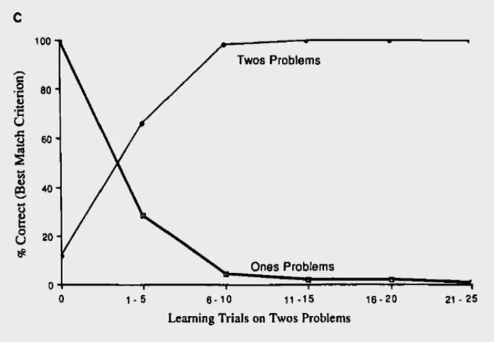
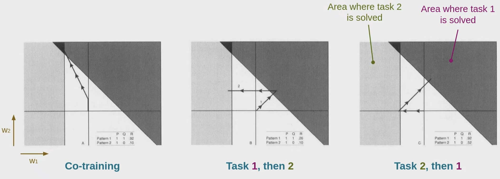
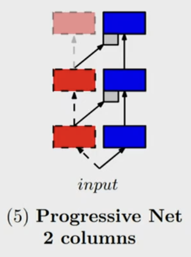
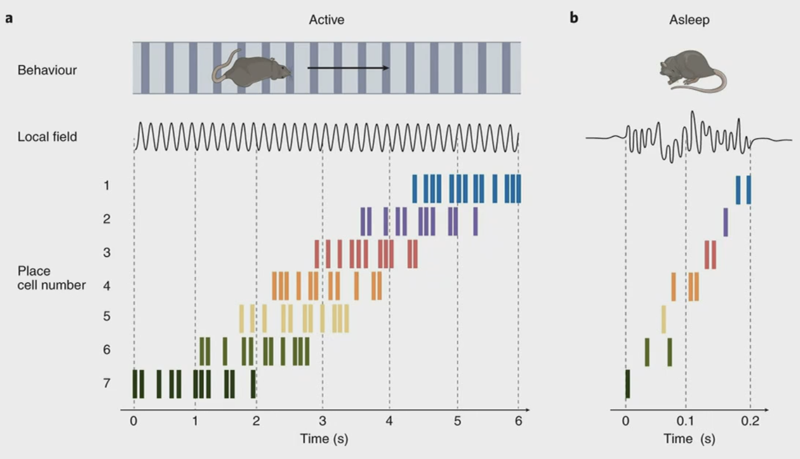
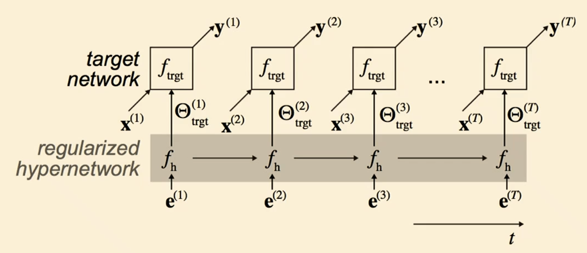

# Continual Learning and Meta Learning

## Continual Learning (Martino) 

### Catastrophic forgetting and Continual learning
- *continual learning*, synonyms: *continuous*, *lifelong* and *incremental* learning
    - related but different concepts: **online**, **transfer**, **meta**, **curriculum** learning
- usually when you want to train multiple tasks, doing different things on same/diff datasets, you have to train interleaving(交织) the two dataset. (normal scenario)
- you train first with dataset/task 1 and then train with dataset/task2 (incremental learning scenario)
    - but after training with second task, you quickly forget on task1 (*catastrophic forgetting*)

    - human does not suffer from this
- explaination from the view in parameter space
    - gradient descent of each task may be contradictory to the other task
- three scenarios for IL(CL)
    - task-IL: solve tasks so far, task-ID provided
    - Domain-IL: solve tasks so far, task-ID not provided
    - class-IL: solve tasks so far and infer task-ID
- Common Benchmark: Split MNIST, task 1 (distinguish 0,1) 2:(2,3)
    - task-IL: with task given, is it the 1st or 2nd class? (e.g. 0 or 1)
    - Domain-IL: with task unknown, is it a 1st or 2nd class? (e.g. in [0,2,4,6,8] or [1,3,5,7,9])
    - Class-IL: with task unknown, which digit is it? (i.e. choice from 0 to 9)
- permuted MNIST: pixel order permutated (not a good idea to use convolution)
    - TASK-IL: given permutation X, which digit?
    - Domain-IL: With permutation unknown, which digit?
    - Class-IL: which digit and which permutation?
- domain-IL is usually the most common scenario

   

### How to we build models that are more resilient to forgeting
- architectural methods
    - work with topology of network, either completely freeze the network, or after the first task, you freeze the neurons.
- regularization-based methods
        - add loss terms to try to keep the network constant in behavior or weights
- data-replay based methods

#### Architectural methods
- progressive networks
    - add piece of network, a few more neurons on each layer
        - if we do not reuse part of the network, this is not continual learning, it is just training a new network
        - if you reuse part of the network, the incremental part can be not that big
    - not scale very well 

#### Regularization methods
- Loss on task B + regularization term that tries to preserve parameters important for task A.
- *Elastic Weight Consolidation*: ``\mathcal{L}(\theta)=\mathcal{L}_B(\theta)+\sum_i \frac{\lambda}{2}F_i\left(\theta_i-\theta_{A, i}^*\right)^2``
    - second term is the fisher information relative to ``\theta_i``, meaning the relavency of certain parameter, or the curvature of parameter space
    - have to do sampling
- *Synaptic Intelligence* similar to EWC, but the importance is done in a completely different way, and can be inplemented online.

#### Data replay methods
- try to store some of the data from task A, and replay it during training task B.
    - would be cheating if you store the whole dataset
    - not cheating if your storing is by neural network itself (e.g. a generative model that generate samples similar to task A)
- Deep generative replay
    - the generator is a gan model that remembers the whole data distribution and can generate synthetic samples
        - each time we train the generator with new data and synthetic data
    - the solver sovles the task, learning on new data and generated data

### How does this relate to what happens in biological brain
- in ML, we either speed up learning rate, so we learn task 2 faster, but we shall also forget faster
    - slow down the learning rate, so we forget task 1 slower, but we shall also learn task 2 less
- in brain we also need a balance between
    - more *stable* synapses, less sensitive to learning
    - more *plastic* synapses, which are mode unstable
- For example, children have more plastic brains, and both learn and forget faster than adults.
- There are three possible answers
- 1. Two complementary learning system, we can have one part of brain that is very plastic, one other part that is very stable, and they talk to each other
    - **hippocampus** is the more plastic part, store shot term memory, episodic memory.
        - large learning rate
        - sparse represenations (minimal interference), does not do high level recognition
    - **Neocortex** is the more stable part, used for generalization
        - small learning rate, learns slower
        - does better job at understanding regularity and association between concepts, higher level tasks
        - long term memory
    - the hippocampus relay the data experienced during day, when human are at REM sleep (快速动眼期 (Rapid eye movement sleep), dreaming session...), to the cortex
    - a mouse, during day, runs at a maze, we can record the place cell pattern in hippocampus,
        - during sleep, the mouse's hippocampus's place cell fire in the same sequence, but in a faster fasion.
- 2. neurogenesis
    - the process of growth of new neurons, known to happen during development in small children at a high rate
    - Adult neurogenesis:
        - slow rates
        - Limited to certain areas of brain, ("neutoriosly", in hippocampus, and olfactory cortex)
    - we could guess new neurons to be *plastic* and older neurons to be more *stable*
    - research on the role of neurogenesis in the formaiton of new meories is inconclusive so far.
- 3. Metaplasticity
    - usually we talk about synaptic strengt, or "weight" which is changed by plasticity
    - but previous activity could also change how easily a synapses undergoes plasticity
    - there are mechanisms to regularte the stability or plasticity of the single synapse, acting on a longer timescale
        - in my words, there are mechanisms that tunes the plasticity based on neuron activity, on the longer timescale
    - this is called **metaplasticity**
    - this is similar to regularization method in ML
- *Biological underpinnings for lifelong learning machines* is a very nice review

 
## Meta Learning (Benjamin)
- learning some task/data in the background (pretrain) to put the network in the position, that can quickly learn new tasks.
    - meaning you can have good zero-shot performance.
- this is about how we can quickly adapt to new task
- why need meta-learning?
    - For many applications we don’t have large training data-sets (medical imaging, robotics, recommendations, real-world agent training). (*dataset not large*)
    - Life-long learning systems should quickly adapt to new tasks, but not forget previous ones (can’t learn every task/classifier from scratch).
    - Sometimes our training data has a long-tail. (*some categories have limited data to train*)

### Basic idea -- learn to learn
- given an uknown concept, human quickly recognize it using previous knowledge,
- paper "Human-level concept learning through probabilistic program induction"
    - they use this idea to train a Bayesian Learner to quickly learn new types of letter, or to generate
    - dataset: *Omniglot*, composed of strokes of letter, to understand how letters composed out of strokes
    - during testing, you are given new classes, and asked to tell what are the strokes
- Meta-learning: given i.i.d. task distribution, learn a new task efficiently
    - more realistically, you learn sequentially, this is continual learning
- usually we have a fast learning system (could be NN/RL/SVM, etc)
    - the meta learning system, aims to give a new set of parameters for the fast learner, given new task, to better adapt to that task. (even if this task is never encountered by meta-learning system)
    - you need a task identifier, when task is finished, when new task starts. (but this is not biological)
- in mathematical form: 
    - a classifier ``f_\theta`` is the "learner" model, trained for operating a given task;
    - a optimizer ``g_\phi`` learns how to update the learner model's parameters via support set ``S``, `` \theta^{\prime}=g_\phi(\theta, S)``
    - in the final optimization step, we need to update both ``\theta`` and ``\phi`` to maximize ``\mathbb{E}_{L \subset \mathcal{L}}\left[\mathbb{E}_{S^L \subset D, B^L \subset D}\left[\sum_{(\mathbf{x}, y) \in B^L} P_{g_\phi\left(\theta, S^L\right)}(y \mid \mathbf{x})\right]\right]``, where ``\mathcal{L}`` is the distribution of task, ``S^{L}`` is the support dataset, and ``B^{L}`` is the testing dataset
- If your old task is completely new (or opposite?), you cannot use your old knowledge
 
### Different types of Meta-Learning approaches
#### metric meta-learning approach
- similar to k-NN or k-means clustering, and kernel density estimation
- assumption is that learned embedding can be generalized to be useful for measuring the distance between images of unknown categories
- the weight is generated by a kernel function ``k_\theta``, measuring the similarity between two data samples ``P_\theta(y \mid \mathbf{x}, S)=\sum_{\left(\mathbf{x}_i, y_i\right) \in S} k_\theta\left(\mathbf{x}, \mathbf{x}_i\right) y_i``
- a good kernel is crucial to metric-based meta-learning model, 
- it aims to learn a metric or distance function over objects, whether a metric is good or bad is problem dependent
- example 1:  *prototypical networks*
    - given a new set of categories, we cluster its feature vector, and get a set of cluster center
    - when new sample comes in, we check the sample's feature's closest cluster center. This is for few shot learning
    - can also use softmax instead of hard maximum ``P(y=c \mid \mathbf{x})=\operatorname{softmax}\left(-d_{\varphi}\left(f_\theta(\mathbf{x}), \mathbf{v}_c\right)\right)=\frac{\exp \left(-d_{\varphi}\left(f_\theta(\mathbf{x}), \mathbf{v}_c\right)\right)}{\sum_{c^{\prime} \in C} \exp \left(-d_{\varphi}\left(f_\theta(\mathbf{x}), \mathbf{v}_{c^{\prime}}\right)\right)}``
        - the loss (maybe for training this meta learner, or representation) is ``\mathcal{L}(\theta)=-\log P_\theta(y=c \mid \mathbf{x})``
- example 2: *Siamese network*
    - contrastive learning, both negative and positive samples, optimizae over KL ``\mathcal{L}(B)=\sum_{\left(\mathbf{x}_i, \mathbf{x}_j, y_i, y_j\right) \in B} \mathbf{1}_{y_i=y_j} \log p\left(\mathbf{x}_i, \mathbf{x}_j\right)+\left(1-\mathbf{1}_{y_i=y_j}\right) \log \left(1-p\left(\mathbf{x}_i, \mathbf{x}_j\right)\right)``, where ``p\left(\mathbf{x}_i, \mathbf{x}_j\right)=\sigma\left(\mathbf{W}\left|f_\theta\left(\mathbf{x}_i\right)-f_\theta\left(\mathbf{x}_j\right)\right|\right)``
- example 3: *Matching Networks*
    - given different class of image, ``g_\theta`` network generate embeddings
    - given a testing image, with another network ``f_\phi``, it generate a new embedding, compute the cosine similarity, and then determined the new class.
    - in mathematical form ``c_S(\mathbf{x})=P(y \mid \mathbf{x}, S)=\sum_{i=1}^k a\left(\mathbf{x}, \mathbf{x}_i\right) y_i``, where ``a\left(\mathbf{x}, \mathbf{x}_i\right)=\frac{\exp \left(\operatorname{cosine}\left(f(\mathbf{x}), g\left(\mathbf{x}_i\right)\right)\right.}{\sum_{j=1}^k \exp \left(\operatorname{cosine}\left(f(\mathbf{x}), g\left(\mathbf{x}_j\right)\right)\right.}``, a little bit like attention
- example 4: *relational networks* (RN), similar to siamese, but 
    - the relationship is not captured by a simple L1 distance in feature space, but predicted by a CNN classifier ``g_\phi``. The relation score between a pair of inputs ``x_i`` and ``x_j`` is ``r_{ij}=g_\phi\left(\left[\mathbf{x}_i, \mathbf{x}_j\right]\right)``, where ``[]`` means concatenation.
    - the objective function is MSE loss instead of cross-entropy, because conceptually RN focus more on predicting relation scores, which is more like regression, rather than binary classification. Loss: ``\mathcal{L}(B)=\sum_{\left(\mathbf{x}_i, \mathbf{x}_j, y_i, y_j\right) \in B}\left(r_{i j}-\mathbf{1}_{y_i=y_j}\right)^2``

#### optimisation based (MAML)
- model agnostic meta learning (MAML)
    - for each task the gradient update go through severl/one steps of ``\theta_i^{\prime}=\theta-\alpha \nabla_\theta \mathcal{L}_{\tau_i}^{(0)}\left(f_\theta\right)``
    - we want the overall updated loss to be small: ``\theta^*=\arg \min _\theta \sum_{\tau_i \sim p(\tau)} \mathcal{L}_{\tau_i}^{(1)}\left(f_{\theta_i^{\prime}}\right)=\arg \min _\theta \sum_{\tau_i \sim p(\tau)} \mathcal{L}_{\tau_i}^{(1)}\left(f_{\theta-\alpha \nabla_\theta \mathcal{L}_{\tau_i}^{(0)}\left(f_\theta\right)}\right)``
    - so the meta initial parameter's update is ``\theta \leftarrow \theta-\beta \nabla_\theta \sum_{\tau_i \sim p(\tau)} \mathcal{L}_{\tau_i}^{(1)}\left(f_{\left.\theta-\alpha \nabla_\theta \mathcal{L}_{\tau_i}^{(0)} f_\theta\right)}\right)``
    - but usually it will give you a parameter that is not good at any task, but learns quicker

#### model based (Meta and Hyper Networks)
- a fast learner ``f_{\theta_i}``, we also generate an embedding for task ``i`` (not sure this is done by fast learner of not)
    - mapping from ``x`` to ``y``
- a hyper network ``h_{\theta_w}``, slow (meta) learner
    - take embedding ``e_i`` and generate parameter ``\theta_i`` that performs first tasks
    - mapping from ``e_i`` to ``\theta_i``
- Inner loop is to train the fast network
- Outer loop is to train the meta network
- training loop looks like 
- If the testing task is a mixure of first and second task, we can interpolate the embeddings of two, then we can generate a set of parameter that do good on both tasks
- from aspect efficiency, training the hyper network only need one ``e`` to ``\theta_T`` mapping
    - while fast learning needs thousands of data points
- hyper network perform always well for permuted mnist-100, never forget anything
    - better than Deep Generative Replay, or Elastic Weight Consolidation, or synaptic intelligence
- experiment also shows this method will also give higher final performance
- might not scale with bigger network
    - a biologically plausible solution is to add prob into network, gatings. this can be tuned by hypernetwork

### Meta-learning in the brain
- evidence for Meta-Learning in the brain
- the prefrontal-cortex as meta-reinforcement learner
- the role of neuromodulation in meta learning