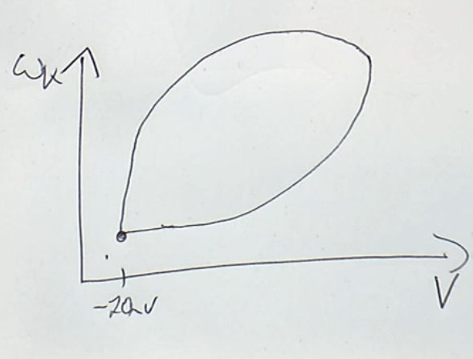

# 09 Deep Learning with Spikes
- one major aspect differentiate bio and artificial NN.
## what is spike
- action potential
- -70mV resting potential, -55mV threshold, +40mV peak value.
- triggered at axon hillocks,
- The value and time course is the fixed for a neuron
- myelination: cells wrap and isolate axon, to speed up signal transition.
    - gap is called nodes of Ranvier, a lot of Na and K channels, to repeat the action potential
    - for long distance transition
- from evolution point of view
    - Ca2+ does not influence transmission a lot, because it does not affect voltage a lot. but have a lot to do with plasticity.
    - but for some very old animals, action potential is driven by Calcium and potassium. 
    - The original Nav2 channel (for Na or Ca) was then replaced by Nav1, which is highly selective of Na, and also faster. good for separating learning signal and transmission. 

## pros and cons about spike
- disadvantages
    - when we digitize analogue signals into spikes, we lose information, due to quantization error. 
        - a block has wides of ``Q=\frac{\max(x) - \min(x)}{2^{N+1}}``, where ``N`` is the number of bits to encode signal
        - Signal-to-Quantization-Noise-Ratio (SQNR) = ``K\times 6.02 N`` dB. (don't know what is this...)
        - Information capacity of a Gaussian channel: ``R=\int_0^\infty \log_2[1+S(f)/N(f)] df``, where S/N is signal to noise ratio.
        - Thoracic ganglion cell have 2500-6000 bits/sec if analogue, 50-220 bits/sec if digitalized,
        - but SNR of analogue signal decrease w.r.t distance, digital ones does not.

    
### non-spiking biological systems and their properties
- purely analogue system
    - Retina, all cell expect ganglion (far distance transmission to LGN) cell are not spiking, 
    - C.Elegans, ~300 neurons, 102 neurons on its head.
        - when the activation stops, the neuron does not go back to its resting potential, it decrease to some points in between, stay there. You need some negative current to make it go back to resting potential.
        - Its potential is not AP, because its shape is not fixed.
        - C.Elegans can spike, but in extreme, non-physiological condition.
- analogue, spike(digital), graded, plateau (digital) potential
- In non-spiking synapses, vesicles are constantly released, and the intensity of release encodes the signal. 
    - It takes large machinery to  maintain this balance, also not energy efficient, usually synapses are much bigger than spiking synapses.
- This is not black and white
    - in short distance, signals are encoded in magnitude (analogue)
    - in long distance, more digitized.
    - this is observed in hippocampus, CA3, DG cells.
    - Further experiments shows that analogue signal decrease exponentially w.r.t distance, and the extremity is about 2 mm.

##  how to measure spike in bio system
- electrode, grounded to cells nearby outside
    - and pin into membrane and test the voltage.
    - actual: patch clamp, a glass tube with liquid similar to outside membrane env, and use electrode to measure membrane inside this tube
- voltage sensitive flourescent die.
    - turn voltage signal into optical signal
- recording indirectly with Ca2+ signal imaging. Advantages: 
    1. Allows to simultaneously record populations of neurons.
    2. Allows cell type (gene specific) labelling and imaging.
    3. Enables repeated (chronic) imagine over many months.

## temporal coding schemes with spikes
- rate coding, information by frequency of firing
- time encoding, the timing of firing can also encode signal, but need a reference timing.
    - in hippocampus, there is a background oscillation signal.
    - an example of temporal coding would be birds locating prays by time difference btw ears, they do this by measuring interneuron signal timing difference.
    - can be applied to ANN, "temporal coding with alpha synaptic function", time to first spike.
        - faster time constant leads to slightly worse performance.
- phase coding in hippocampus, place cell that only fires when you are at specific location.

## intro to neural spiking dynamics
- properties of sodium (Na+) channel
    - depolarize neuron when open (-70mV -> +40 mV)
    - establish a positive feedback loop (regenerative), when voltage goes up, it should have more Na+ channels open --> drives V further up.
    - we want a threshold voltage that this feedback loop happens (-55 mV to -45mV), when below threshould, the loop should drive V to decrese, else increase.
- dynamic system of a Neuron
    - state variable V(t), for simplicity ``0\leq V(t) \leq 1``
    - parameter ``a`` is the threshould voltage
- model requirements
    - if ``V<a``, then ``V\to 0``,
    - if ``V > a``, then ``v\to 1``.
- The simplest model: ``\partial_t V = f(V)``
    - ``dV/dt = -V(V-a)(V-1)``, problem, the voltage will stay at ``1``, but this is not the real case.
- properties of K+ channels
    - K+ channels open --> leads to V decrease
    - K+ channels should be V dependent
    - k+ channels are slow, so that we can achieve
        - V increase --> triggers fast Na+ inflow --> V increase further  --> (millisecond latter) K+ open --> push V down to resting potential
- Refined model (Fitz-Nagumo equation):
    - state: voltage ``V(t)``, numer of open K+ channels ``\omega_K(t)``
    - ``d \omega_K / dt = (-\gamma \omega_K + V)\times \varepsilon``
    - ``d V / dt = - V(V-a)(V-1) - \omega_K``
    - phase diagram:

- Hodgkin-Huxley(HH) model skipped

