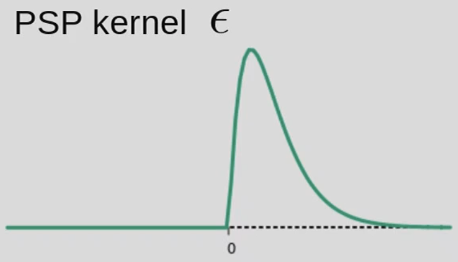
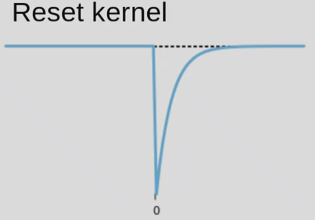
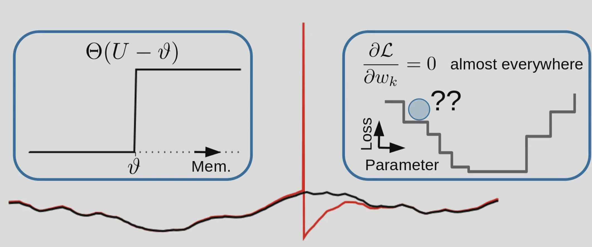
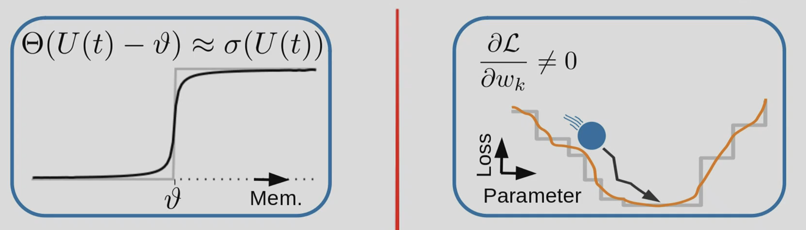
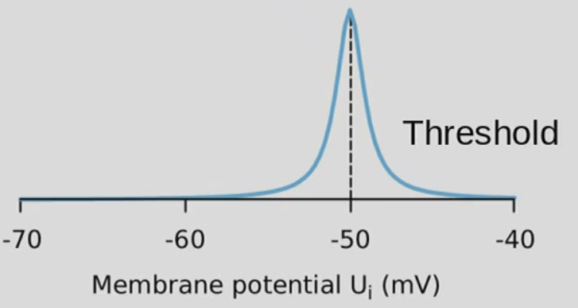

# 09 Deep learning with Spikes
- neurobiology mostly uses spiking neural networks
- computational model provide an accurate account of single neuron dynamics
    - experimentally patched a pre-synapse neuron and input noise, record the post-synaptic neuron, the recorded signal agree well with integrate and fire model
    - IF model: ``C \dot{V}(t) =-g_{\mathrm{L}}\left(V(t)-E_{\mathrm{L}}\right)-\sum_{\hat{t}_j<t} \eta\left(t-\hat{t}_j\right)+I(t)``, ``V_T(t) =V_T^*+\sum_{\hat{t}_j<t} \gamma\left(t-\hat{t}_j\right)``
    - Real neuron is not 100% reliable
        - even if you inject same input to real neuron, you can somethings get no spikes and sometimes spikes.
- Why study spike  neural network?
    - understand brain function and dysfunciton (neuroscience)
    - build more energy efficient compute devices (neuromorphic engineering)
- The space of all possible networks is ginormous (big), for ``n=17`` neuron, there are ``2^{(17^2})\approx 9.9\times 10^{86}`` possible configuration
- how do hidden units learn
    - bottom-up approach
        - start with a random network model
        - include data driven plasticity model
        - observe function -> limited success in learning useful hidden layer representations
    - top-down approach
        - start with function in mind
        - derive suitable plasticity rules
        - build funcitonal network models
- DL update: ``\Delta W_{i j} \propto-\frac{\partial \mathcal{L}}{\partial W_{i j}}``
- for SNN, there are two question
    - algorithmic: how to compute the gradient?
    - conceptual: which functions are learned?

## Part 1
- Outline:
    - problems with differentiability, 
    - mapping surrogate gradients onto plausible local learning rules
- Aim supervised learnign in multi-layer SNN (seq-to-seq task)
- problems
    - spikes -> ill defined derivative
    - temporal credit asignment
- solutions 
    - brief view existing smoothing solutions
    - derivation of bio-plausible surrogate gradients learning rule: superspike
- network modeling largely relies on simplified neuron models
- neuron model 0.1: passive membrane
    - ``\tau \frac{\mathrm{d}}{\mathrm{d} t} U(t)=-\left(U(t)-U_{\text {rest }}\right)+R_{\mathrm{in}} I(t)``, where ``\tau=RC``
- neuron model 1:  the leaky integrate-and-fire neuron (LIF)
    - ``\tau \frac{\mathrm{d}}{\mathrm{d} t} U(t)=-\left(U(t)-U_{\text {rest }}\right)+R_{\mathrm{in}} I(t)``
    - non-linear spike:  If ``U`` exceed threshold, generate a spike, then reset to resting potential
    - simplest, doesnot account for any synapses dynamics
- neuron model 2: exponential postsynaptic currents
    - two diff eq: models the current that goes into the synapse ``\frac{\mathrm{d}}{\mathrm{d} t} I(t)=-\frac{I(t)}{\tau_{\text {syn }}}+\sum_j w_{ij} S_j(t)``
    - ``S_j(t)`` is Dirac delta function
    - ``\tau \frac{\mathrm{d}}{\mathrm{d} t} U(t)=-\left(U(t)-U_{\text {rest }}\right)+R_{\mathrm{in}} I(t)``
    - we artificially do not allow this neuron to fire again, to simulate the refractory period.
- the spike response model (SRM0)
    - another way of compactly writing this IF model: ``\mathrm{U}_i(t)=\sum_j w_{i j}\left(\epsilon * S_j\right)(t)+\left(\eta * S_i\right)(t)+U_{\text {rest }}``
    - 
    - 
    - the second term is used to reset U from threshold to zero, mannually turn the nolinearity from U into ``S_i``
- How to train SNN?
    - input spatiotemporal input
    - output target spike train
    - adjust weights: surrogate gradients
    - loss:
        - Van Rossum distance ``S(t)=\sum_l \delta\left(t-t^l\right)``, and ``\mathcal{L}=\frac{1}{2} \int_{-\infty}^t[\lambda *(\hat{S}(s)-S(s))]^2 d s``
        - problem: the derivative of a spike train vanishes almost everywhere ``-\frac{\partial \mathcal{L}}{\partial w_k}=\int_{-\infty}^t \lambda *(\hat{S}(s)-S(s)) \lambda * \frac{\partial S(t)}{\partial w_k} d s``, this is called the *error signal*
        - 
- Some options for solving the gradient problem:
    - Option 1: Noise injection
        - smooth out everything that is non-differentiable
        - cons: noise hurt gradient in the end
    - Option 2: Differentiate firing times
    - Option 3: Make spikes differentiable
        - replace spike with sigmoid, not biology does, nor there is efficiency
    - Option 4: Force hidden units "on target"
    - Option 5: e.g. firing-rate approaches
    - Option 6: Network translation (ANN -> SNN)
        - common but use less and less, train an ANN, and transfer weights to SNN
        - OK with images, but loss temporal dimension
        - comes from a rate model and use spikes to emulate the rate, we prefer direct training
- Today's menu: Surrogate gradients
    - replace Heviside with sigmoid 
    - derivative: ``\frac{\partial S_i}{\partial w_{i j}} \approx \underbrace{\sigma^{\prime}\left(U_i\right)}_{\text {post }} \underbrace{\epsilon * S_j(t)}_{\text {pre }}``
    - we ignore the reset dynamics in ``U``, making things better and more  stable during optimizaiton.
    - this is a local learning rule, ``\frac{\partial w_{i j}}{\partial t} \equiv \lambda *(\underbrace{\epsilon * S_j(t)}_{\text {pre }} \underbrace{f\left(U_i\right)}_{\text {post }})\times \underbrace{e_i(t)}_{\text {error signal }}``, *error signal* + ``f`` is ``\sigma'`` or other function *post* signal + *pre* signal.
        - this looks related to *STDP-like* learning rule, at least like a hebbian learning rule
        - *voltage nonlinearity*, something like this 
            - you only have plasticity (weight update) when you depolarize the membrane (voltage around threshould), this coincide with biological observation.
        - *error signal* is the third factor, depends on specific feedback.
        - the ``\lambda *``, can be interpret0ate as *eligibility trace*, corresponds to Calsium Ca2+. If functions as bringing the past pre- and post- neural activities to futher.
- Push to multi-layer
    - ``\frac{\partial w_{i j}}{\partial t} \equiv \sum_k e_k(t) \epsilon *\left[w_{k i} \epsilon *\left(\epsilon * S_j(t) \sigma^{\prime}\left(U_i\right)\right) \sigma^{\prime}\left(U_k\right)\right]``
    - sum of errors appears in downstream neurons, there have to be some form of feadback that inform this neuron ??? ( what is this?)
    -  problems:
        - symmetric weights (teacher does not explain)
        - not biologically plausible, there is no way for this neuron to know (physical access) the direvative of downstream neuron (weight non-locality problem)
    - proposed solution 
        - feedback alignment, random feedback, symmetric feedback
        - straight-through estimatior, set the ``\left[w_{k i} \epsilon *\left(\epsilon * S_j(t) \sigma^{\prime}\left(U_i\right)\right) \sigma^{\prime}\left(U_k\right)\right]`` to ``1`` (not so sure).
    - If we use symmetric feed back or random feekback, and also use straight-through estim, we get back to single layer case, have the same learning rule, expect that error term turns int sum of down-stream error
        - all quantities computed online. Temporal credit assignment through dynamics at synaptic level through eligibility traces (**no backpropagation through time**)
    - for learning 1-hidden-layer NN, random feedback works, symm feedback better. but no hidden layer network does not work, uniform feedback (always 1) also does not work

###  unsupervised learning, a spiking auto-encoder with Gaussian input
- instead of possion input, you give gaussian input (teach does not say how to)
- a bottle-neck of hidden layer, and to reconstruct the original input

## Part 2
- outline:
    - exploring spiking networksw trained with back-propagation through time (not plausible)
    - Take a brief journey through a spiking networks optimization landscape
    - Look at sensitivity to surrogate nonlinearity
    - Approach: Back-propagation through time & surrogate gradients (Classification tasks)
- Important insight: Spiking neural networks are binary RNNs with specific intrinsic recurrence
- Write it into RNN form
    - ``I_i^{(1)}[n+1]=\underbrace{\alpha I_i^{(1)}[n]}_{\text {exp. current decay }}+\underbrace{\sum_j W_{i j} S_j^{(0)}[n]}_{\text {feed-forward input }}``
    - ``U_i^{(1)}[n+1]=\beta U_i^{(1)}[n]+I_i^{(1)}[n]-S_i[n]`` similar decay + input
    - ``S_i^{(1)}[n]=\Theta\left(U_i^{(1)}[n]-\vartheta\right)`` 
    - we can train this with BPTT (backprop through time) or RTRL (real time recurrent learning, forward prop through time, rarely used, not efficient)
    - we can replace heviside with surrogate gradient, to train the network.
- neuromorphic engineers build hardware that seeks to *emulate* neural network instead of *simulating* them
    - we want the physics of hardware to do the LIF model
    - but problem is *device mismatch*, a stumbling block for widespead use of analog neuromorphic hardware, task performance drop from simulation to emulation.
    - the teacher shows we can use surrogate gradient to traing on chip, 85k images @ 200mW, 100times more efficient
        - this method can also calibrate system for mismatch problem.