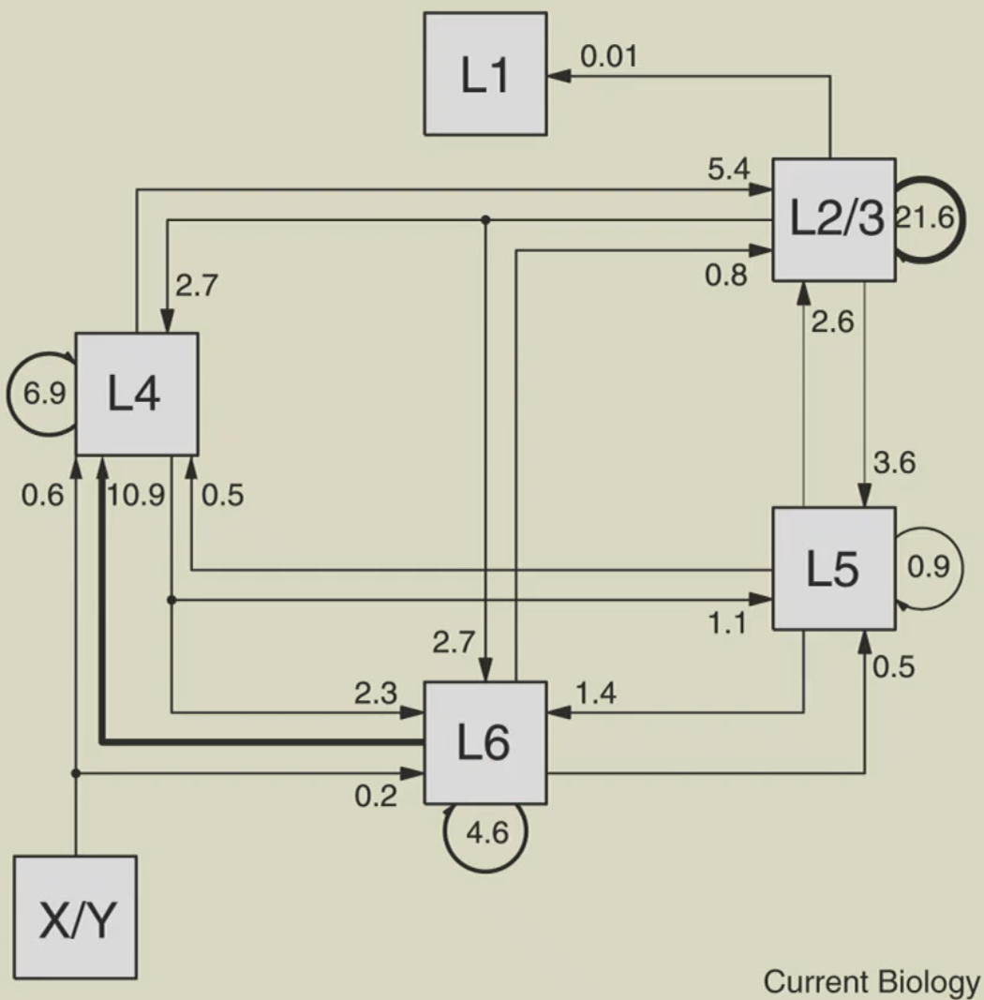
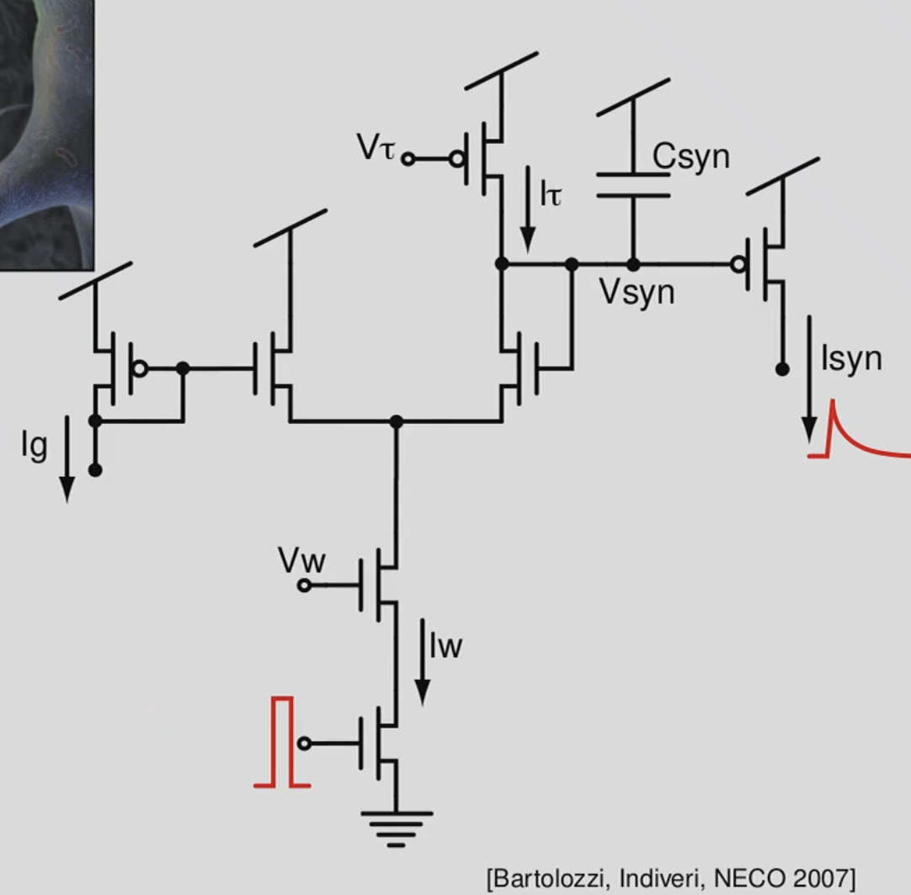
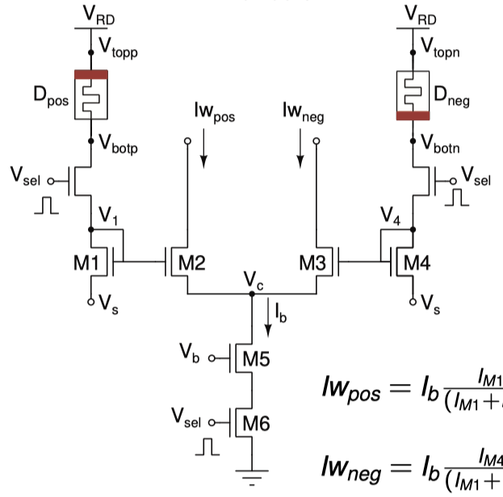
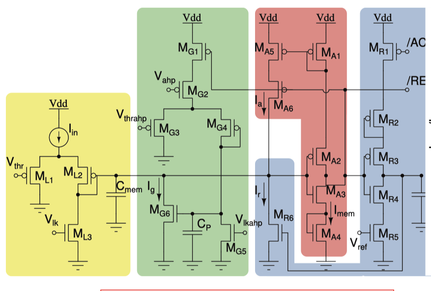
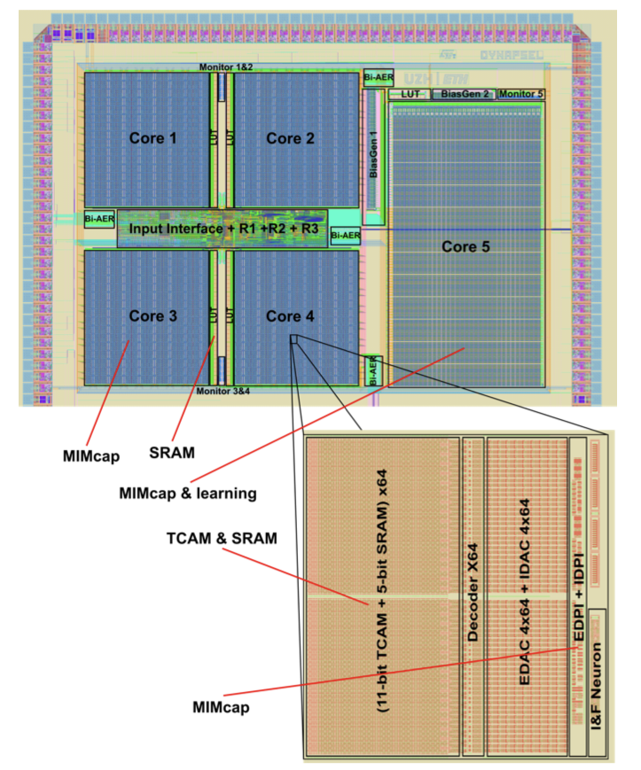
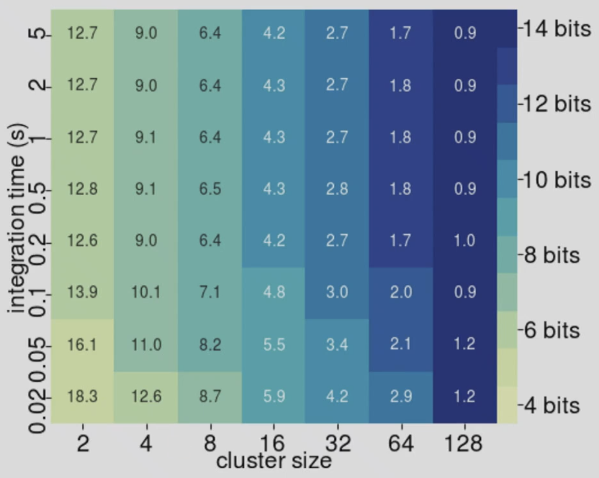

# 10 Neuromorphic Intelligence: brain-inspired electronic sensory-processing systems

## basic notions of neuroscience
- ANN: simulate abstract brain-inspired computing architecture on digital time-multiplexed computing substrate.
    - ignore time, process with unit time and get output, time evolution is never taken into account.
    - time of input (e.g. speach) is totally ignored and independent of processing
- neuromorphic architectures
    - use the physics of electronic devices and circuits to emulate real neurons.
    - use physical real time and circuit dynamics to compute through their time evolution.
    - the physical hardware substrate is the algorithm
- 10~100 ms of time constant of post-synaptic current
- EPSPs can also be non-linear, first response is higher, second and after is lower, short-term depression.
- you can model neuron action potential generation process similar to synapsese with RC circuits,
    - the passive behavior is very well modeled with first order low-pass filter RC circuits,  means, if you have a constant (step) input to the neuron, then you will see the membrane potential rise exponentially with a negative exponent, if you take the input away, it will decay exponentially.
    - If your input is above threshold, you will have non-linear behavior that produce action potential
- real mechaism: Na channels open first pull up membrane potential, K channels open then, to pull down action potential, even longer --> hyper polarizing --> refractory period
- neuromorpic assume the actual shape of action potential is not a major roll in computation, so IF is enough, no more complex model
    - we want to model the property that if your input current doubles, your firing frequency doubles
    - there will be a range of linear relationship between I and f, (f cannot be infinity, there will be a plateau), also there is a refractory period to prevent f to be infinity, this determined the plateau.
    - this is the limitation of physical system, but also can be used of, you are not allowing your neuron to produce to high freq, at most 200~300 Hz.
- Synapses vs neurons
    - in biology:
        - pyramidal neurons have thousands of synapses, mainly distributed on the dystal dentric arborization
        - the excitatory drive from 10-40 inputs, discharging at an average rate of 100 spikes/sec should cause the postsynaptic neuron to discharge near 100 spikes/sec.
    - in neurons
        - to first order approximation, aneuron has a gain of less that 1/10 (*single input have small effects on neurons*)
        - to produce on output spike, at least input 10 spikes should arrive in parallel to 10 different synapses
        - an input spike train arriving onto a single synapses at 1kHz should produce on putput spike train at 100Hz
        - we are using the collective behavior of the inputs, so the single noise/error in single neuron doesn't matter much
        - It could be possible that the membrane potential is already near threshold, and only a few spikes can trigger a spike, this means the reaction time can be much shorter than the integration time
- One important difference: ***Dale's*** principle: In practice Dale’s law requires neurons to be only excitatory or only inhibitory.
    - in ANN or SNN, if you manually constrain the weight to be positive or negative, it is very difficult to get the same accuracy
    - but in neuromorphic chips, current can only be either push or pull from the transistor, so they share this properties in common with biological neurons
- Dendrites:  
    - non-linear active fasion, can amplify or decrease, depending on the membrane potential and the state.
    - can implement analog signal processing, digital logic and state dependent computations.
    - one single but complex neuron can approximate a large ANN, can classify linearly non-separable inputs.
    - recently proved it can also solve *credit assignment* problem
- Neocortex: 90% of cerebral cortex and 76% of the entire brain, 
    - distinguishing feature of mammals
    - they all have same building block, a recurrent network of 6 layers (or 4)
    - can classify neuron into class of dozen, that lives in this 6-layers
    - accross all areas of neocortex
        - most cortial connections are local and excitatory
        - most coritcal excitatory synapses and almost all inhibitory ones originate from cortical neurons
        - most of these synapses originate from neurons within the local cortical area
    - cortical computation
        - is carried out almost entirely by local circuits
        - recurrent circuits perfrom signal restoration
        - control of gain is critical for cortical computation
    - Douglas et al. 1995 shows this 6-layer circuits works as amplifier, can control the gain by control the amount of excitation and inhibition
        - also they show this network can do signal reconstruction

## Neuron and synapses models
- synapses: excitatory (AMPA & NMDA), inhibitory (GABA-A GABA-B)
    - AMPA is fast, 10ms, NMDA slow 100ms
    - GABA-A faster, GABA-B slower
    - model:
        -  First order approximation ``\tau \frac{d}{d t} I_{\text {syn }}(t)+I_{\text {syn }}(t)=I_w \delta\left(t_{\text {pre }}\right)``
        - Alpha funciton approximation ``\tau_{\text {pos }} \frac{d}{d t} I_{\text {pos }}(t)+I_{\text {pos }}(t)=I_w \delta\left(t_{\text {pre }}\right)``, ``\tau_{\text {neg }} \frac{d}{d t} I_{\text {neg }}(t)+I_{\text {neg }}(t)=I_w \delta\left(t_{\text {pre }}\right)``, ``I_{\text {syn }}(t)=I_{\text {pos }}(t)-I_{\text {neg }}(t)`` with ``\tau_{\text {pos }}<\tau_{n e g}``
    - we have to make the circuit's time constant to be coincide with the input time constant
- model of neuron: 
    - IF: ``I(t)=C \frac{d}{d t} V_m(t)``, ``V_m(t)=V_{\text {rest }} \text { if } V_m \geq V_{t h}``
    - McCulloch and Pitts: ``y_k=\varphi\left(\sum_{j=1}^N w_{k j} x_j\right)``, linear threshould units, binary inputs/outpus
    - Hodgkin-Huxley model, can really explain the data
        - cell lipid bilayer (membrain): capacitance/area
        - Leaky channels: linear conductance
        - Voltage-gated ion channels: conductance (V,t), voltage-dependent open-close probability
        - ``C_{\text {mem }} \frac{d V_{\text {mem }}}{d t}+\sum I_i+I_{\text {syn }}+I_{\text {leak }}=0``
        - for each ionic current ``l_i=g_i \cdot m^p \cdot h^q``, ``\tau_m \frac{d m}{d t}=m_{\infty}-m``, ``m_{\infty}=\frac{1}{1+e^{\frac{\text { offset } t_m-V_m m}{\text { pentem }}}}``

## ANN
- cons for ANN
    - energy intensive
    - high cost of data movement: DRAM access is at least 1500x more costly than a MAC operation in CNN acceleration. (most energy is lost on data movement)
        - *in-memory computing* is really very hot
    - narrow AI: DNNs programmed to perform a limited set of tasks. They operate within a pre-determined pre-defined range.
        - back-propagation is not bio-plausible. (Hinton proposed forward-forward)

## Neuromorphic engineer
- architechture is the algorithm
- this is a "stateful" network, memory inside cpu, 
- exploit physical space
    - use parallel arrays of processing elements
    - *no time-multiplexing*, 1000 neurons means 1000 units on chip, (not true on GPU), 
        - wasted computing unit, but save power
    - co-localize memory and computation
    - use passive circuits, data driven, in continuous time
    - exploit all the properties of transistors and memoristors
- *Let time represent itself* (in traditional AI, training/inference time is decoupled from physical time)
    - for interacting with the environment in real-time
    - to match the circuit time constants to the input signal dynamics
    - for inherently synchronizing with the real-world natural events
    - to process sensory signals efficiently

## Analog subthreshold circuits
- synapse analog circuits
    - 
    - the transistor gives this ``\tau \frac{d}{d t} I_{s y n}+I_{s y n}=\frac{I_g I_w}{I_\tau}``, ``\tau=\frac{C U_T}{\kappa I_\tau}``
    - emulate nerons circuit well, time constant addjustable (10ms-500ms), so can model AMPA or NMDA
- *Memoristors*
    - 10x10x10 nm of mateiral, if given voltage spike, you will have ions move around, and then you can change the conductance,
    - a memory element that does not burn power
    - you can have petabytes of them, non-valitile memory, stays there
    - A (Gilbert) normalizer memristive synapse circuit: 
        - ``I w_{\text {pos }}=I_b \frac{I_{M 1}}{\left(I_{M 1}+I_{M 4}\right)}``, ``I_{n e g}=I_b \frac{I_{M 4}}{\left(I_{M 1}+I_{M 4}\right)}``
- Silicon neurons 
    - 
    - ``\tau \frac{d}{d t} I_{m e m}+I_{m e m} \approx \frac{I_{\text {th }} I_{\text {in }}}{I_\tau}-I_g+f\left(I_{m e m}\right)``, and ``\tau_{a h p} \frac{d}{d t} I_g+I_g=\frac{I_{t h r} I_{a h p}}{I_{\tau_{a h p}}}``
        - ``I_g`` is an adaptive slow variable, coule to the input, the more spikes, the larger ``I_g``, and the smaller is the input, so is *spike-freq adaptation*

##  Neuromorphic processor
- mixed-signal neuromorphic processor chips
    - 
    - each core have 256 neurons, and their synapese
    - Analog and digital co-design 
    - On-chip inference and learning 
    - Reconfigurable architecture 
    - Distributed SRAM and TCAM memory cells
    - Capacitors for state dynamics 
    - Ideal for integration with binary, non-volatile resistive memory devices 
    - Ideal for integration with dynamic, volatile/non-volatile memristive devices 
    - Ideal for integration in 3D VLSI technology (another memory tech)
    - memory is about 70% percent of the chip, connectivity reconfigurable, with standard digital logic.
- Why spikes?
    - Signal processing systems that need to process real-world sensory signals and interact with the environment in real-time.
    - Requirements
        - Low power and low-latency.
        - Local processing, multi-core architectures and distributed computing.
        - Robust communication of signals across long distances through noisy channels.
    - Solution: use spikes!
        - The optimal method that minimizes bandwidth and power consumption for achieving this goal, under these constraints, is pulse-frequency modulation. (biology choose the most efficient way)
- Why analog?
    - advantages
        - Exploit the full potential of emerging memory technologies
            - Control multi-level properties with analog pulse heights Exploit intrinsic non-linearities [Brivio et al., 2021]
            - Exploit intrinsic stochasticity [Gaba et al., 2013, Payvand et al., 2018] Exploit non-volatility properties [Berdan et al., 2016, Demirag et al., 2021]
        - Avoid use of digital clock circuitry (takes big area in traditional CPU)
        - Avoid large DAC/ADC overhead
        - Minimize power consumption
- PCM-trace:
    - Exploit the drift of PCM devices to implement long-lasting eligibility traces. These enable the construction of powerful learning mechanisms for solving complex tasks by bridging the synaptic (~ms) and behavioral time-scales (~minutes).
    - can use the non-linearity properties of these device to implement eligibility traces
    - allow you to do RL, or other things that require memories lasting for minutes or hours

### Disadvantages
- every analog devices are different, how can you guarantee the behavior/performance to be identical?
    - the respondse time is about 25% coefficient variation for this silicon neuron
- how to cope with mismatch? do average
    - integrate over space (population of neurons) and time (mean rates)
    -  
    - 8 bits is a sweet spot, if you use 8 neurons and average over 100ms, you will get an acc about 8-bits
- *False myth* about analog neural respons
    - neural responses are slow:
        - for neurons near threshould, response time can be faster. 
        - on average, the population of neuron can be faster than single neuron (~50 times)
    - neurons need to fire at high rate to achieve high precision
    - neurons need to be accurate to propagate precise informations across population layers

## Application
- High-Frequency Oscillation (HFO)
    - detecting patterns in biological signals
    - HFO: Spontaneous EEG events in the frequency range between 80 and 500 Hz consisting of at least four oscillations that clearly stand out from the baseline.
    - pations have to do surgery to get rid of epileptic (癫痫) region, where is this region?
        - EEG cannot see this, but freqency diagram from electrode can discover, patient have to do operation many times
    - with SNN (one-layer, tune without BP), adjust time-constant of synaps. better than SOTA

## Conclusion
- pros:
    - low latency
    - ultra low-power
- cons
    - limited resoluion
    - high variability, noisy
- what are they good for
    - Real-time sensory-motor processing 
    - Sensory-fusion and on-line classification 
    - Low-latency decision making
- bad at:
    - High accuracy pattern recognition 
    - High precision number crunching 
    - Batch processing of data sets
- How to program a neuromorphic processor (algorihtm - architecture co-design)
    - Configure network structure and parameters 
    - Train the network with different learning methods
    - Define neural computational primitives 
    - Compose multiple primitives for context dependent processing

