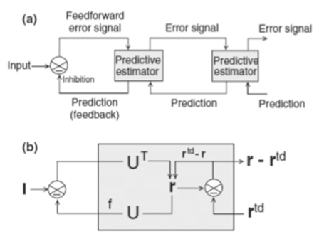
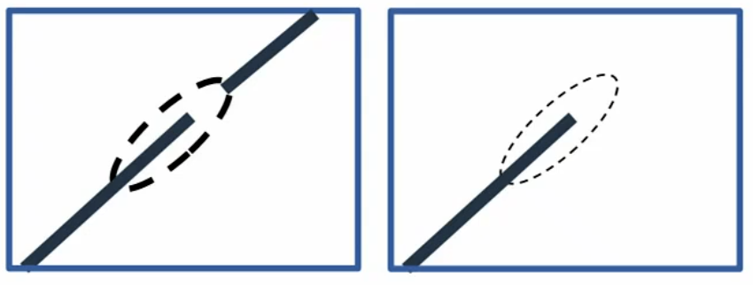
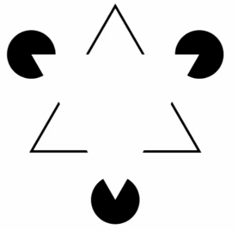
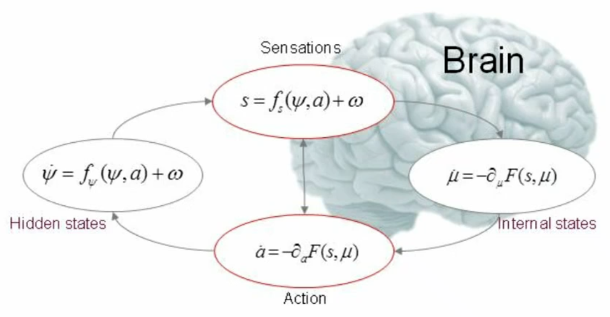

# 11 Predictive Coding
- brains compressed a log of information
    - 4K video compressed bitrate: 44-85 Mbps
    - optic nerve: <1 Mbps
    - some properties of bit-rate of spike
        - how many spikes depends on neuron type
        - the more often a neuron spike, the less informative it is
        - the noise is measured by reproducibility
- solution: send only the unexpected information (standard video cmopression philosophy)
- this is also observed in human: *mismatch negativity*
    - visual: always vertical lines, but suddenly horizontle line
    - audio: a music with sudden out-of-key note
    - both observe significan change in neuro activity
- MMN is widely studies in health
    - Dyslexia (失读症): Diminished MMN in auditory stimuli (Kala et al 2000)
    - Schizophrenia(精神分裂症): Shorter MMN durations before psychotic episodes (2010)
    - Alcoholism (酗酒): Decreased MMN response, but enhanced after rehab. (Ahverninen et al, 2000 Audiology an Neurotology)
    - Autism (自闭症): Prolonged/reduced MMN latencies (Ferri et al 2003/Abdeltawwab and Baz, 2015)
- Predictive coding cause *Flash-Lag Effect* (https://michaelbach.de/ot/mot-flashLag/)
    - the always existing rotating line, you can always predicted, so it is precived faster in brain
    - but the flashing line, is not regular, so your brain takes longer time to precive
    - it cause the illusion that these lines are not colinear
- another example would be tennis
    - given the ball speed and processing time from visual to motor, a tennis player cannot be seeing the ball!
    - a professional play would predict the ball's location
    - done at low processing level
- application to RNNs: Training to RNNs to predict sequences automatically enforces “good” representations
    - train to reduce the error, how is the face gona look in the next timestep
- Predictive Coding in static case: we describe a picture of "rectangle with a dot in it", instead of describe it with pixel, this is a high level description
    - An example by (McClelland & Rumelhart 1981): humans can be much easier to infer a letter if it is in the middle of a word
    - the fact that you have prior knowledge of the word, helps you identify better and faster
    - this says, *if you have a higher level description of an object, your brain will be better processing it*

## Predictive coding in circuit level (Rao & Ballard)
- 

- ``I=f_1(Ur)+n``, 
    - ``r`` is the prediction (representation)
    - ``n`` is noise
    - ``I`` is the input
    - I think this is the predictive direction
- ``r=r^{td} + n^{td}``
    - ``r^{td}`` is the prediction from **top down** (from high level representaiton)
    - ``n^{td}`` is the noise, or difference between
- ``r^{td} = f_2(U^{h} \circ r^h)``
    - don't know wtf is this ``r^h``, from the paper, it says ``r^{h}`` is the higher-level representation
    - we assume ``n\sim \mathcal{N} (0, \sigma^2)``, and ``n^{td}\sim \mathcal{N}(0, \sigma^2_{td})``
- Energy function to optimize: ``E_1=\frac{1}{\sigma^2}(\mathbf{I}-f(\mathrm{Ur}))^{\mathrm{T}}(\mathbf{I}-f(\mathrm{Ur}))+\frac{1}{\sigma_{t d}^2}\left(\mathbf{r}-\mathbf{r}^{t d}\right)^{\mathrm{T}}\left(\mathbf{r}-\mathbf{r}^{t d}\right)``
    - teacher says if we apply gaussian assup into it, the loss turns into ``\log (I|r)``, given prediction what is the output. BUT WTF is this shit. 
    - difference of prediction
    - I think in this loss, the input ``I`` is the observed value.
- In the paper, the total loss is ``E=E_1+g(\mathbf{r})+h(\mathrm{U})``, where ``g`` and ``h`` is the NLL of pior.
    - seems this is just ELBO....
    - gaussian gives prior of ``g(\mathbf{r})=\alpha \Sigma_i r_i^2`` and ``h(\mathrm{U})=\lambda \Sigma_{i, j} \mathrm{U}_{i, j}^2``
    - but can also choose sparse kurtotic prior, ``g(\mathbf{r})=\alpha \sum_i \log \left(1+r_i^2\right)``
- Training ``\frac{d \mathbf{r}}{d t}=-\frac{k_1}{2} \frac{\partial E}{\partial \mathbf{r}}=\frac{k_1}{\sigma^2} \mathrm{U}^{\mathrm{T}} \frac{\partial f^{\mathrm{T}}}{\partial \mathbf{x}}(\mathrm{I}-f(\mathrm{Ur}))+\frac{k_1}{\sigma_{t d}^2}\left(\mathbf{r}^{t d}-\mathbf{r}\right)-\frac{k_1}{2} g^{\prime}(\mathbf{r})``
    - ``\frac{d \mathrm{U}}{d t}=-\frac{k_2}{2} \frac{\partial E}{\partial \mathrm{U}}=\frac{k_2}{\sigma^2} \frac{\partial f^{\mathrm{T}}}{\partial \mathrm{x}}(\mathrm{I}-f(\mathrm{Ur})) \mathbf{r}^{\mathrm{T}}-k_2 \lambda \mathrm{U}`` parameter with l2 regularizer.
- In my own opinion, this is just a simplified VAE, but this was published in 1999... 15 years before Kingma

## Predictive coding to supervised learning
- model: Input ``I`` --> ``\hat{r}_1`` layer 1 --> ``\hat{r}_2`` layer 2 --> ``\hat{r}_3`` layer 3
    - this is the estimation from input
    - each layer by matrix ``W_j``
- meanwhile you also have some true representation that generates input: ``r_3`` --> ``r_2`` --> ``r_1``
    - and there is error between each layer ``e_i = r_i - \hat{r}_i``
    - teacher: we want to distribute errors accross layers
- training ``\frac{d r_i}{dt} = e_i - \sum_{j\in \operatorname{Child}(i)}e_j \frac{\partial \hat{r}_j}{\partial r_i}``
    - I think this can be derived from chain rule...
    - ``e^{*}_i := \sum_{j\in \operatorname{Child}(i)}e_j \frac{\partial \hat{r}_j}{\partial r_i}`` change of coordinates
- training of matrix ``\frac{d W_i}{ d t} = e_i^{*} \frac{\partial \hat{r_i}}{\partial W_i}``
- all these update rule can be derived by minimizing sum of squre of all layer
    
## Predictive coding in brain
- Bastos et al. 2012 Neuron: split information flow by layer
    - thalamus usually flows into L4
    - L4 --> L2/3-E
    - L2/3 --> L5/6 
    - L5/6 --> L4
- L2/3 is the most recurrent part of brain, so the time scale is longer, input stays longer there
    - so the frequency band of L2/3 and L4 is different, 
    - fast info is gamma wave, slower is beta wave
- Keller et al's work: mice see lines that simulate walking in a line, VR. There is also wheels that make can sync with video
    - we can make discrepency/mismatch on movement and visual signal. forward but no move, move but no videos forwarding. *Counterfactual setting*
    - they find when there is mismatch, some neurons will fire. (O’Tolle et al. 2021 bioarxiv)

## Interpretation issues
- Problem I: errors, representations and interpretation (Kogo & Trengove 2014)
    - you cannot have a prediction to fool yourself with
    - you have to make proper testable prediction??? (wtf)
    - 
    - the neuron fires can either encode end of line, or error of a continuing line (this actually fires more).
        - hard to disentangle neron that encodes error, or just encode the end of a line
    - 
        - the lines that does not exist, but precived by human, are they prediction errors, or perception errors? hard to make interpretation
- Problem II: learning and mismatch negativity
    - the most active neuron get suppressed, as learning, your mismatch activity should goes down
    - but this is not observed
- Perception as Inference
    - there is an internal model that you fit from the world
    - e.g. you have a prior knowledge of depth can shape the size you observed, so you can infer depth from this prior knowledge. This is the idea of *Bayesian Brain*
- Clinical explanation with MMN and Bayesian brain
    - some autism(自闭症) patient need very strict routine
    - this has been related to the disfunciton of brain to do predictions (internal model cannot genneralize well)
    - another case, these people are overwhelmed by external sensory input, so they (not hearing clear) may be obsessed with there internal model?
        - cannot tell imagination and reality. (movie: a beautiful mind)

## Free Energy Principle
- ``z`` latent, ``P(z|x) \approx Q(z')`` approximation
    - by Bayes law ``p(z|x) = p(x|z)p(z)/\int p(x|z')p(z') dz'``
- by minimizing ``KL(Q || P(z|x))`` which can be shown to be equivalent to maximizing ELBO
- ``\log p(x) = KL (Q(z) || P(z)) + \mathbb{E}_q \log P(x|z)``
- ELBO in some people's words is called free energy ``\mathcal{F}[(s, a, \mu)]``
    - 

    - ``\phi`` hidden states ``\dot{\psi}=f_\psi(\psi, a)+\omega``
    - sensations ``s=f_s(\psi, a)+\omega``
    - ``\dot{\mu}=-\partial_\mu F(s, \mu)`` internal states
    - action ``\dot{a}=-\partial_a F(s, \mu)`` this is the interesting part, the intention of action is to minimize the uncertainty of the world.
        - in the traditional VI, we update parameters to better fit internal model to the world, but only from passively received data
        - now we can choose action, as part of inference
- Dark room problem:
    - we can also choose action that block all sensations