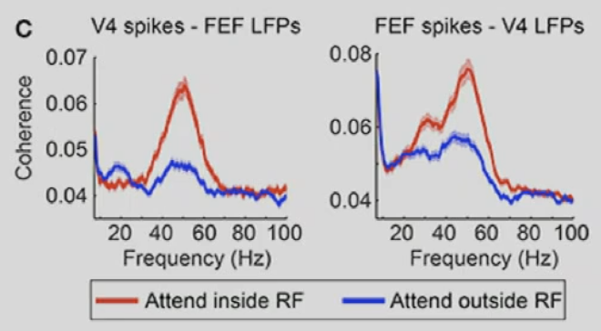

# 13 Attention

## Attention in neuroscience
### Definition of attention
- William James in Principles of Psychology (1890): 
    - *Attention* is the taking possession by the mind in clear and vivid form, of one out of what seem several simultaneously possible objects or trains of thought...It implies withdrawal from some things in order to deal effectively with others,….
- Lindsay (2020): 
    - Attention is the flexible control of limited computational resources.

### What is selective attention in biology
- In primates, ``10^6`` retinal ganglion cell axons can carry about 1 MB/s of visual information (already compressed).
    - This is too much to be handled in real-time by the brain (there are many other sensory domains that feed data into the brain).
    - Some fraction of sensory input is selected for processing by higher-level, cognitive routines, while the non-attended portion of the input is processed at a reduced bandwidth.
    - Attention is common to all animals (fruit fly, fish, moneys, mice). Deeply rooted in evolution
- two different types of attention
- Bottom-up attention
    - spatial specificity: throughout field of view
        - active all the time, not in our control, transient (fast)
    - feature specificity: acts at all times, and in all feature dimensions (saliency显着性)
        - things or features that we see first or easier to attend first, is called features with *high saliency*
    - duration: transient
    - task dependency: no
    - under volitional(意志) control: no
- Top-down attention
    - spatial specificity: spatially proscribed (focal)
    - feature specificity: can select specific attribute (colors object's features)
    - duration: sustained (with effort)
    - task dependency: Yes
    - under volitional control: Yes

#### Bottom up attention
- model of saliency (bottom up), Itty & Koch 2001
    - there is a feature map to saliency map. and saliency map have one-take-all rule (max-pooling?)
    - Single map that encodes saliency is feed by multiple feature maps. Which features draw the gaze independent of the task is unknown. Typically, these are faces, orientations, color and intensity.
    - After detecting the most salient location, its salience is inhibited.
    - <u>Single cell evidence</u> for salience map in the initial response of LIP (lateral intraparietal cortex, in mice) and FEF (frontal eye fields) neurons in primates.
- use human gaze-map as groud truth in CV
    - do not work so well for complex scene
    - use a lot in advertisement design

#### Top down attention
- Is flexible and task dependent.
- Can last indefinitely with effort.
- Spatial based, feature based and object based are forms of top-down attention.
- A close relationship between neuronal mechanics controlling eye gaze and selective attention (LIP, FEF, V4, SC).
- teacher gives an example of people focusing on the map but does not notice the person holding the map changed
- experiments by Paneri at al 2017
    - forcusing on FEF to V4 region
    - steps:
        - 1. initially a whilte dot to attend to
        - 2. give three color of stimuli, three colored circle with black lines
        - 3. then the cue is given: the white dot in the center changed in to one of the three colors
        - 4. then we give distractor, some colors of the three circle changes
        - 5. then (i am not so sure) let the monkey select target color change?
    - this method can distinguish attention inside/outside receptive fields
    - measure activity in V4 
        - If attention inside RF, the frequency more concentrated
    - can also see LFP region.
    - If further measures the time difference in arrival of signal in FEF and V4, 
        - they find, FEF --> V4 --> FEF ...
        - fast gamma rythms in these two area.

## attention models in ML
- teacher shows attention definition by ChatGPT
### Self Attention
- traditional rnn/lstm model: start state and end state
    - not parallel, time consuming
- CNN: fixed memory/RF, leads to short dependency
- self attention combine two things: parallel computation and long dependencies
    - ``\mathrm{Y}=\mathrm{WX}^{\top}`` where ``w_{i j}^{\prime}=\frac{\mathbf{x}_i^{\top} \mathbf{x}_j}{\sqrt{k}}``
    - improve with key, query, value transformation ``\begin{aligned}
\mathbf{k}_{\mathrm{i}} & =\mathbf{K} \mathbf{x}_i+\mathbf{b}_{\mathrm{k}} \\
\mathrm{q}_{\mathrm{i}} & =\mathbf{Q} \mathbf{x}_i+\mathbf{b}_{\mathbf{q}} \\
\mathbf{v}_i & =\mathbf{V} \mathbf{x}_i+\mathbf{b}_v
\end{aligned}``
- improving SA: using *multi head attention*
    - sacled dot product
    - a set-to-set layer, no access to sequential sturcture of input --> use positional encoding

### Transformer
- transformer block: layer norm + SA + skip connection + LN + SA + SC
- transformer is layers of these block
- *casual transformer* use attention mask to set all future values in attention to ``-\infty`` to prevent seeing the future
- *positional encoding* to let model remember position
- original transformer is a translation model with *encoder/decoder* structure

### GPT-3 and chatgpt
- no encoder/decoder, only stack of causal transformer blocks
- a lot of parameter, cost a lot to train