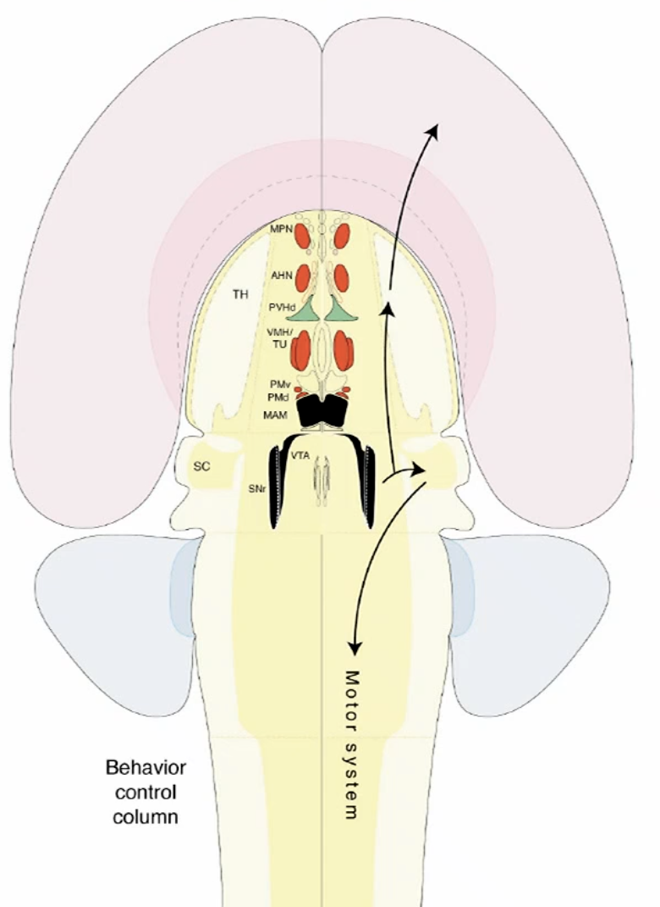
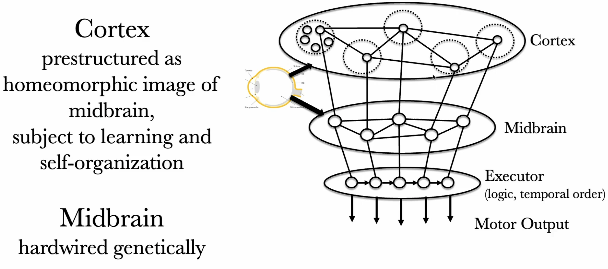
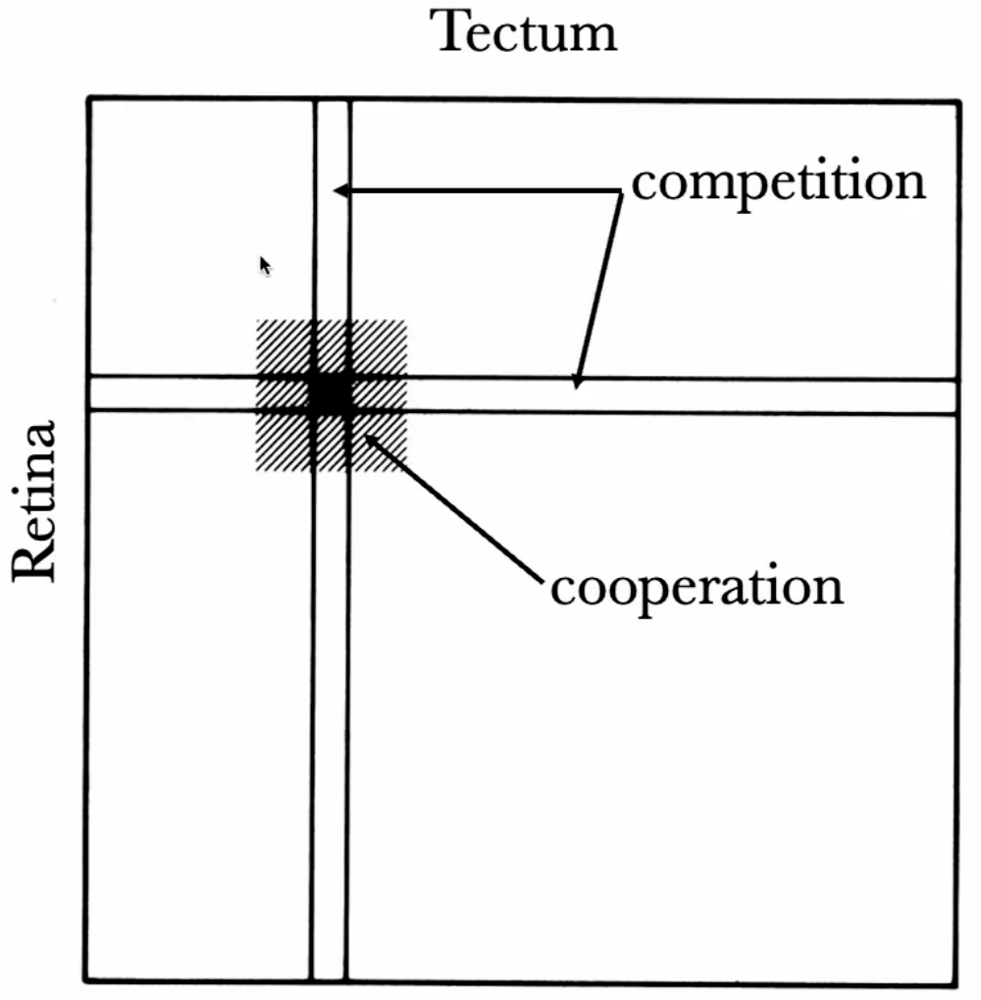

# Self Organization -- How can biological leanring be so efficient?
## Deep learning
- Limitation of DL
    - looking through human eyes
        - stuff about language, images
        - functions are all about human understanding
    - cannot behave in natual environments
        - Moravec's paradox,  (the observation by artificial intelligence and robotics researchers that, contrary to traditional assumptions, reasoning requires very little computation, but sensorimotor and perception skills require enormous computational resources. )
            - animals and human have built-in drives (satisfying hunger, looking for spouse, caltural drive: impressing your peers, ), 
                - in DL drive is only repeat what human has shown you, (there are curiosity driven algorithms, already though, but under development)
            - Fail to develop L5 autonomous cars
                - difficulty is in corner cases, infinite number of traffic situations, never forseen.
    - Situation awarness
        - when you talk to chapgpt, you are nobody for this thing, system knows nothing about you, your interest, context.
    - Personality
        - DL have no sense of responsibility, veracity (constraint to only say facts), ethics (not subject to law)
    - Efficient learning
        - learning is slow, not efficient in data.

## Ontogenesis
- ontogenesis (个体发生学，或称做形态发生学，是描述一个生命体从受精卵到成体的起源和发育。)
    - brain wired to function at birth
        - e.g. ingestive, reproductive, defensive behavior
    - Reptile brain inherited through eons
    - expansion into cerebral hemisphere
- certain early period of brain (mapping of mature brain to its early stage): 
    - neural plate, 2D thing, a tube
    - this shows that, the brain of our anscestor, 100milliion years ago, is in very complex form.
    - the yellow part in the middle, later turns into mid-brain, hyper-thalamus, regulate basic functions of the animal, 
        - being functional at the very beginning of birth, pre-wired
        - also called *reptile brain*
    - the pink part, cortex, is developed and expanded afterwards. (the blue part is the cerebellum (小脑))
- Homeomorphic expansion (同胚展开)
    - cortex is not pre-wirde, but mid-brain is, but its connection is prestructured as homeomorphic image of mid-brain, subject to learning and self-organization.
- Information Content of the brain
    - ``10^{10}`` neurons
    - ``10^{14}`` synaptic connections
    - 33 bits address per connection
    - ``10^{15}`` bytes to describe the brain's wiring.
- genetic information: one gigabyte (3.3 billion necleotides)
- this information gap, where is this wiring information come from
- Kolmogorov Complexity: the shortest algorithm to create a structure
    - a math example would be Julia set: ``f_c(z)  =z^2+c, c =-0.7269+0.1889``, but very complex pattern. Iterate ``z=f(z)``, if blow up, color white, else black.
    - can create a lot of structure, but only certain structures can be created that way
    - so the brain must have low Kolmogorov complexity, powerfully reduced search space.
- the brain's kolmogorov algorithm: network self-organization
    - start with initial wiring/connectivity pattern
    - connections changed by plasticity, and in turn change the neuron activity
    - this change will finally converge to an *attractor*, that stablized itself.
- Ontogenesis of retinotopic fiber projections, as an example of network self-organization (wiring of retina)
    - how the neurons of retina and tectum wired in an ordered way
    - the neurons are guided by morphogens, gradient of chemical markers, towards tectum
    - initially  after they reach the tectum, neurons are randomly wired, but after a day or so, they  are well organized in continuous mapping. But how is it done? network self-organization
    - neighboring fiber *cooperate* (based on activity corelation) (initially chemical signal, then electric signal)
    - there are also *competition* of fiber comming from same location to different position in tectum (*divergenct* and *convergent* competition) (really?)
    - 1D toy model, connectivity is shown as 2D matrix :
        - mathematical form: ``W_{\tau \rho}`` denotes the connection from ``\rho`` to ``\tau``, then ``\dot{W}_{\tau \rho}=\alpha+W_{\tau \rho} F_{\tau \rho}-W_{\tau \rho} B_{\tau \rho}(\alpha+W F)``
            - where ``B_{\tau \rho}(X)=\frac{1}{2 N}\left(\sum_{\tau^{\prime}} X_{\tau^{\prime} \rho}+\sum_{\rho^{\prime}} X_{\tau \rho^{\prime}}\right)`` is the divergent and convergent inhibition between synapses
            - and ``F_{\tau \rho}=\sum_{\tau^{\prime} \rho^{\prime}} C_{\tau \tau^{\prime}}^T W_{\tau^{\prime} \rho^{\prime}} C_{\rho^{\prime} \rho}^R`` is the cooperativity, ``C_{\rho\rho'}`` is big for neighboring ``rho``
            - orientation of initial condition is important, it determines the final attactor (could be in opposite direction)
            - this is a collective/swarm behavior
        - DL does not make use of this

### Network emerge on the basis of self-consistency of connectivity
- two type of connectivity pattern that dominates the brain: neural fields and topological mappings
    - 2D sheet of neighborhood connected neuron, (meaning two sheets of neuron, A's neighbor connects to B's neighbor)
        - if in each position, you have a group of neuron, then you will have a combinatorial moduplasticity of connectivity patterns (don't understand wtf is this)
        - continuous mapping between parts of sheet to parts of sheets

## Representation/Perception
- at each moment, we only see pixels, and features of these pixel, but sequentially, we build a framework of the scene
- computer graphics are now able to create realistic scene, they also generate a way of scene description: geometry, edges, silouette, coloring, material, shading
    - the inverse problem: perception is going from images to composing modalities
    - if you start with image, a lot of information is not there, e.g. the depth profile, 
- when a picture projected to human, it takes 0.5s to get organized in mind the content of the picture, it is quick for human
- object recognition by network emergence ( totally BS base on nothing...)
    - the image of a face comes into our visual cortex in form of 2D array of local texture elements, which are connect amoung neighbors.
    - model claims: in order to recognize the person, you need a model of the person, in another part of the cortex (fusiform face area (FFA) of inferior temporal(IT) cortex, where the actual recognition take place). The idea is that this model has the same format. (I think the teacher means that the observed model matches the internal model in the brain)
    - the teacher thinks that this representation is a 2D sheet of neuron with interal texture feature, in order to identify the observed model, you need connection to reference model (those neurons in the brain)?
        - the neighborhood preserving connectivity pattern that can be switched in as long as you move your eyes.
    - the brain is an overlay of fragments of these neurons
    - recognition of novel object
        - e.g. a tricycle, the brain percepts each element part of the tricycle as a semantic element (a schema)
        - the brain also have to (have a generation model) to put these concept into 3D scene, 
        - then the brain can map these to visual cortex. 
        - there will be a static correlation of an actual moving tricycle, to this schema in the brain
        - by mapping this schema to motor cortex and sensory, you will get a large-tail network pattern, including motor and snesory signal, which together forms a self stablizing network

## Learning
- the amount of information from sensory system is quite bit (volumnious)
- the relationship of *World* -- *sensory information* -- *world model* of the brain
    - world (in sense of generating the visual signal, or in view of CG) can be summarized in very compact form
    - the information is expanded into floods of pictures during sensory
    - the brain again, compressed the sensory into compact world model (model box), 
        - that is able to reconstruct the sensory input (I think, a generative model)
        - learning takes place in this compact world model
    - the conclusion is: perception precedes learning, perception must be there at birth
- learning is only within the focus of attention (FoA)
    - FoA is shaped by Behavior
    - Learning is shaped by strategy
- learning is gated by emotions
    - all people have experience that you can remember a sentence forever, even you only heard once in your life, there is a very strong emotion reason for you to put that into your memory
    - locus coeruleus, a part of brain that project to everywher of brain, 
        - this is key to plasticity

## Conclusion
- efficient learning need
    - a functional initial state
    - behavior drive
    - embodiment (sensory motor interaction that gives you feeling of reality of env)
    - scene representation
    - perception
    - focal attention

